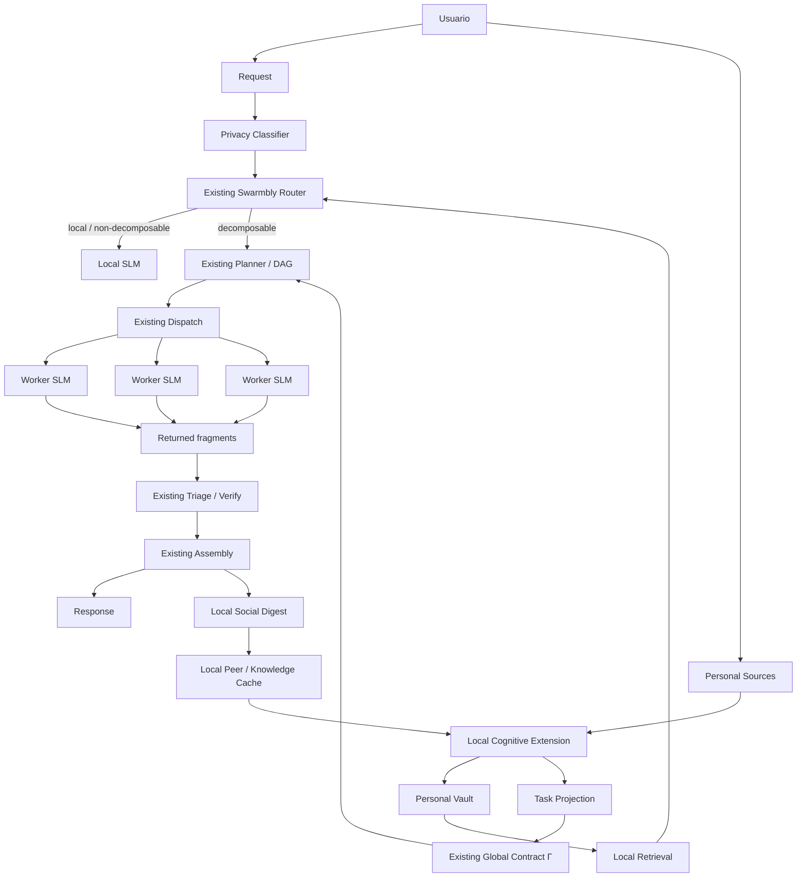
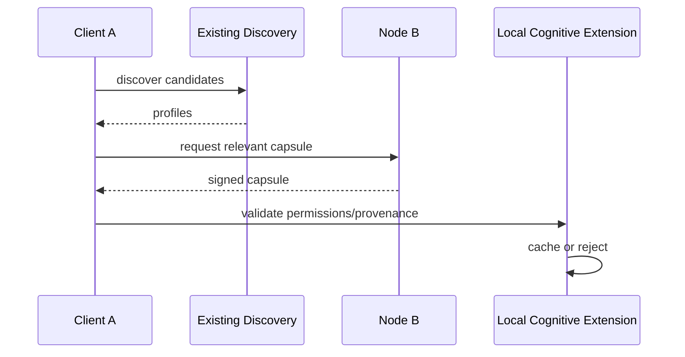
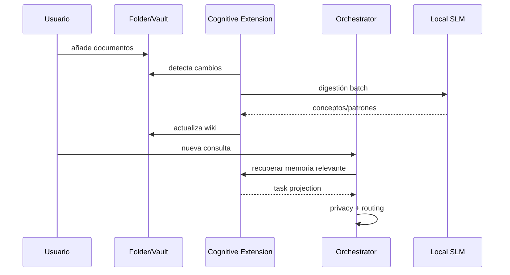
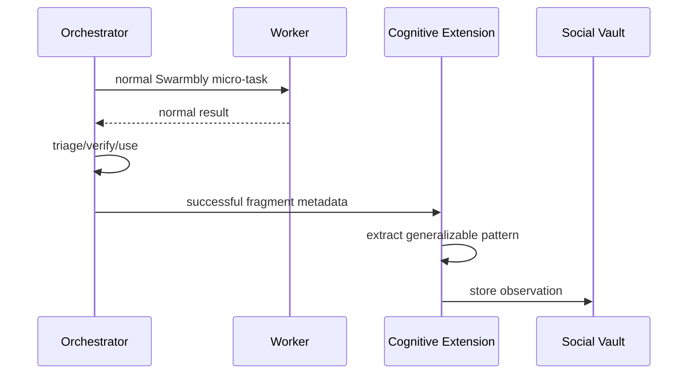
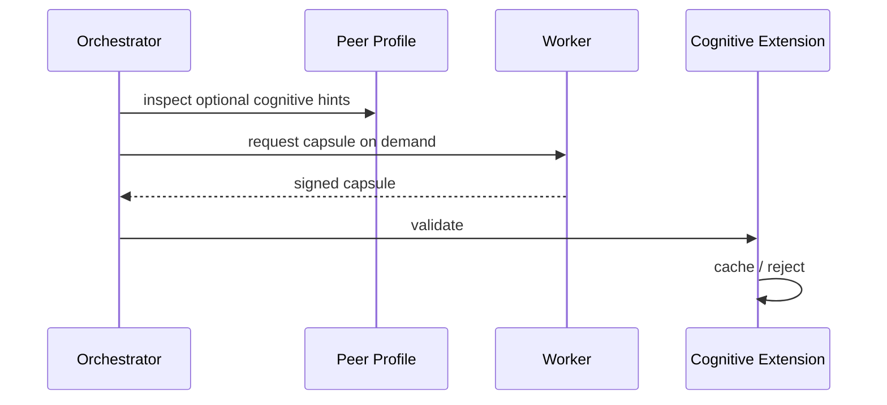

# Swarmbly Cognitive Extension
## Arquitectura local-first para memoria, aprendizaje personal y transferencia ligera de conocimiento sobre el protocolo real de Swarmbly

**Versión conceptual:** 0.2  
**Fecha:** 30 de septiembre de 2026  
**Estado:** propuesta de extensión; NO forma parte todavía del protocolo Swarmbly v0.2/v0.3  
**Documento reemplazante:** este texto sustituye la arquitectura cognitiva anterior, que introducía subsistemas innecesarios y no respetaba suficientemente la arquitectura actual de Swarmbly.

---

# 0. Propósito y corrección de arquitectura

Este documento desarrolla una posible capa de aprendizaje continuo para Swarmbly partiendo de una restricción fundamental:

> **La extensión cognitiva debe adaptarse a Swarmbly; Swarmbly no debe deformarse para alojar la extensión cognitiva.**

La arquitectura actual de Swarmbly ya define su núcleo:

- un **cliente/orquestador local**;
- uno o más modelos locales pequeños en el lado del cliente;
- **workers independientes**, cada uno ejecutando un SLM completo;
- fragmentación del **problema**, no del modelo;
- planificación mediante DAG;
- un contrato global `Γ`;
- clasificación de sensibilidad antes de enviar cualquier paquete;
- dispatch de micro-tareas;
- redundancia selectiva;
- triage;
- verificación;
- ensamblaje local;
- auditoría de coherencia;
- perfiles de workers;
- descubrimiento P2P y servicios de red deliberadamente mínimos.

La nueva propuesta no debe crear, por defecto:

- otro Knowledge Graph global;
- otro Compute Graph;
- otro sistema de routing;
- una red P2P social paralela;
- un servicio global de replicación;
- un trust engine independiente;
- una blockchain;
- entrenamiento distribuido continuo;
- gossip permanente entre nodos;
- un modelo global compartido;
- una base de datos global de identidad.

En su lugar, la propuesta introduce una **Local Cognitive Extension (LCE)**: una capa opcional que vive principalmente en el dispositivo del usuario y reutiliza los primitives de Swarmbly cuando necesita comunicarse con la red.

---

# 1. Arquitectura de Swarmbly que se debe preservar

## 1.1. Principio de funcionamiento

Swarmbly no intenta ejecutar un gran modelo partido entre máquinas.

Su unidad distribuida es el **trabajo semántico**.

```text
REQUEST
   ↓
CLIENT / ORCHESTRATOR
   ↓
ROUTER
   ↓
PLANNER
   ↓
DAG of semantic micro-tasks
   ↓
DISPATCH
   ↓
independent complete SLM workers
   ↓
RESULT FRAGMENTS
   ↓
TRIAGE / VERIFY
   ↓
ASSEMBLY
   ↓
RESPONSE
```

La red se cruza una vez por unidad de trabajo y no en cada token generado.

La extensión cognitiva debe respetar esa propiedad.

---

## 1.2. Roles existentes

### Client / Orchestrator

Responsable de:

- clasificación de privacidad;
- decisión de fragmentar o no;
- planificación;
- generación del contrato `Γ`;
- packing de contexto;
- selección de workers;
- dispatch;
- verificación;
- ensamblaje;
- auditoría.

### Worker

Responsable de:

- declarar su perfil;
- recibir una micro-tarea;
- ejecutarla con un modelo completo;
- devolver un resultado firmado;
- emitir telemetry / commitments requeridos.

### Network services

Deben permanecer mínimos:

- peer discovery;
- registry / reputation;
- credit accounting;
- audit sampling.

La extensión cognitiva no debe convertir esta capa mínima en una plataforma pesada.

---

# 2. Objetivo de la extensión cognitiva

La Local Cognitive Extension busca añadir cuatro capacidades:

1. **Memoria personal persistente.**
2. **Aprendizaje local controlado por el usuario.**
3. **Especialización progresiva de uno o varios SLM locales.**
4. **Transferencia ligera y opcional de conocimiento generalizable entre nodos.**

La tesis es:

> Cada nodo puede desarrollar una representación local y portable de lo que su usuario le ha enseñado, sin convertir ese conocimiento en una obligación de red ni en una copia completa del usuario.

Y, en una segunda etapa:

> Los nodos pueden aprender patrones útiles derivados de interacciones autorizadas con otros nodos, sin intercambiar modelos completos ni mantener una red social paralela.

---

# 3. Lo que cambia respecto a la propuesta anterior

## 3.1. Se elimina el Knowledge Graph global

No se necesita un grafo de conocimiento global.

Puede existir un grafo **local** derivado del vault del usuario, pero:

- vive en su máquina;
- puede ser implícito mediante links Markdown;
- puede representarse en SQLite;
- no requiere Neo4j;
- no requiere sincronización global.

---

## 3.2. Se elimina un Compute Graph paralelo

Swarmbly ya posee información de:

- recursos;
- modelos;
- RTT;
- desempeño;
- disponibilidad.

La extensión no necesita inventar otro plano global de cómputo.

---

## 3.3. Se elimina el “Social Mesh” como red independiente

Los nodos ya son peers dentro de Swarmbly.

Los “vecindarios cognitivos” se implementarán inicialmente como:

> **una caché local de afinidad hacia peers que el cliente ya descubre y utiliza.**

No se requiere un servicio central de comunidades.

---

## 3.4. Se elimina el gossip permanente

Un nodo no debe enviar periódicamente su memoria a los demás.

El intercambio de conocimiento debe ser:

- explícitamente permitido;
- pequeño;
- bajo demanda;
- relacionado con una tarea real;
- cacheable.

---

## 3.5. Se elimina el fine-tuning continuo obligatorio

Fine-tuning es opcional.

La mayoría del aprendizaje puede ocurrir mediante:

```text
Wiki
+
retrieval
+
task-specific context
+
small local profile
```

Solo una fracción estable del conocimiento debería convertirse en LoRA u otro adapter.

---

# 4. Principio arquitectónico: Local First, Network When Useful

La jerarquía propuesta:

```text
L0 — context of current request
L1 — local model
L2 — local personal memory
L3 — local social cache
L4 — existing Swarmbly workers
L5 — external sources, if user allows
```

Antes de consultar la red:

1. el nodo intenta resolver localmente;
2. recupera memoria personal;
3. recupera conocimiento social previamente cacheado;
4. si sigue siendo útil, utiliza el flujo normal de Swarmbly.

Esto reduce:

- tráfico;
- latencia;
- consumo;
- exposición de información;
- dependencia de nodos externos.

---

# 5. Vista general de la arquitectura corregida



Punto clave:

> **La extensión cognitiva se conecta al cliente/orquestador. No sustituye el flujo de Swarmbly.**

---

# 6. Local Cognitive Extension (LCE)

La LCE puede implementarse como una biblioteca o “sidecar” local del cliente.

No necesita ser un conjunto de microservicios.

Una implementación inicial podría ser un único proceso con módulos internos.

```text
Local Cognitive Extension
├── Source Watcher
├── Digestion Pipeline
├── Personal Vault
├── Retrieval Index
├── Cognitive Profile
├── Social Cache
├── Training Queue
└── Policy Manager
```

---

# 7. Personal Source Space

El usuario selecciona explícitamente qué fuentes puede aprender su nodo.

Ejemplo:

```text
~/SwarmblyBrain/
├── inbox/
├── knowledge/
├── style/
├── reference/
├── private/
└── shareable/
```

Cada carpeta puede tener una política distinta.

Ejemplo:

```yaml
knowledge:
  remember: true
  use_for_retrieval: true
  use_for_training: true
  share: false

style:
  remember: true
  use_for_training: true
  share: false

shareable:
  remember: true
  use_for_training: true
  share: true
```

---

# 8. Obsidian / Markdown como memoria legible

Una opción especialmente apropiada es utilizar Markdown como representación canónica.

Obsidian puede actuar como interfaz humana.

La arquitectura no debe depender de Obsidian como servicio.

```text
Personal Vault
├── self/
├── concepts/
├── terminology/
├── projects/
├── procedures/
├── sources/
├── social/
└── training/
```

Ventajas:

- portable;
- visible;
- editable;
- versionable;
- barato;
- independiente del modelo;
- compatible con Git;
- procesable sin base de datos pesada.

---

# 9. Digestión de información

Inspirado en enfoques tipo LLM-Wiki, la información no se almacena únicamente como chunks.

Pipeline:

```text
new source
   ↓
parse
   ↓
identify concepts
   ↓
extract relationships
   ↓
detect terminology
   ↓
identify preferences / style
   ↓
link with existing notes
   ↓
update Markdown
```

La digestión puede utilizar el mismo SLM local que ya posee el cliente.

No se necesita mantener otro modelo cargado permanentemente.

---

# 10. Política de carga de modelos

Una máquina limitada no debe tener cinco modelos residentes simultáneamente.

La arquitectura soporta varios modelos lógicos, pero los carga bajo demanda.

Ejemplo:

```text
Local model registry

orchestrator_model → model A
digest_model       → model A, different prompt
critic_model       → model B, only when needed
specialist_model   → optional
```

En hardware pequeño:

```text
one model
multiple roles
```

En hardware potente:

```text
multiple models
parallel roles
```

El protocolo no debe asumir una configuración concreta.

---

# 11. Tipos de memoria local

## 11.1. Personal semantic memory

Conocimiento que el usuario decidió enseñar.

```text
concepts
facts
terminology
methods
project knowledge
```

## 11.2. Preference memory

```text
preferred wording
format
language
tone
response length
coding conventions
```

## 11.3. Episodic memory

Opcional:

```text
past interactions
decisions
events
```

Debe utilizarse principalmente para retrieval, no para fine-tuning automático.

## 11.4. Social memory

Patrones derivados de interacciones autorizadas con la red.

Debe estar físicamente y lógicamente separado de:

```text
self/
```

---

# 12. Cognitive Profile

El nodo puede mantener un pequeño perfil local condensado.

Ejemplo:

```yaml
languages:
  es: primary
  en: fluent

style:
  technical: 0.84
  conversational: 0.73

preferred_terms:
  - "semantic fragmentation"

domains:
  distributed_ai: 0.82
  genomics: 0.91

response_preferences:
  explanations: detailed
```

Este archivo NO debe enviarse completo a la red.

---

# 13. Task Projection: la pieza que conecta memoria con Swarmbly

Para cada solicitud, la LCE genera una proyección mínima:

```text
Personal Cognitive State
       ↓
Task relevance filter
       ↓
Task Projection
```

Ejemplo:

```yaml
register: technical
preferred_terms:
  - semantic fragmentation

entities:
  Swarmbly: "Swarmbly"

style_anchor:
  precise and explanatory
```

---

# 14. Reutilización del contrato Γ

Una gran parte de la personalización ya cabe en campos que Swarmbly posee.

El `Γ` actual incluye conceptos como:

```text
objective
audience
register
format
lexicon
entities
style_seed
budget
```

La extensión debe proyectar la información personal relevante dentro de estos campos.

Ejemplo:

```text
Personal preference
        ↓
"technical but accessible"
        ↓
Γ.register
Γ.style_seed
```

Terminología:

```text
Personal Vault
   ↓
preferred terminology
   ↓
Γ.lexicon
```

Nombres:

```text
Personal Vault
   ↓
canonical entities
   ↓
Γ.entities
```

Esto evita añadir un nuevo “personalization packet”.

---

# 15. Regla del Context Budget

La memoria personal compite con el presupuesto de contexto.

Por tanto, no debe enviarse indiscriminadamente.

```text
relevant memory
+
Γ
+
fragment context
≤
allowed context budget
```

La personalización debe ser una compresión relevante, no una biografía completa.

---

# 16. Privacidad

La extensión debe ejecutarse antes del dispatch.

Orden:

```text
request
↓
personal retrieval
↓
sensitivity classification
↓
determine lane
↓
network decision
```

Si la memoria recuperada eleva la sensibilidad:

```text
PUBLIC → SANITISABLE
```

o:

```text
SANITISABLE → SENSITIVE / LOCAL
```

el tier debe elevarse.

Nunca reducirse automáticamente.

---

# 17. No aprender automáticamente del tráfico de otros usuarios

Un worker puede ver un fragmento de una solicitud.

Eso NO significa que tenga derecho a convertirlo en memoria permanente.

Regla por defecto:

```text
incoming worker task
→ execute
→ return result
→ discard content
```

El worker no debe entrenarse ni actualizar su wiki con el contenido de la tarea por defecto.

---

# 18. Opt-in explícito para aprendizaje compartido

Una futura extensión puede permitir:

```yaml
learning_permission:
  retain_generalized: true
  retain_raw: false
  redistribute: false
```

Pero el default debe ser:

```text
NO RETENTION
```

Esto evita convertir el voluntariado computacional en recolección involuntaria de datos.

---

# 19. Aprendizaje desde los resultados que recibe el propio cliente

El cliente sí puede analizar los resultados de sus propias solicitudes.

Flujo:

```text
returned fragment
↓
normal Swarmbly verification
↓
used in response?
↓
local social digest
```

El Social Digest puede extraer:

- terminología nueva;
- estilos culturales generales;
- formas de explicación;
- patrones de dominio;
- candidatos a conocimiento.

Sin conservar necesariamente el fragmento completo.

---

# 20. El aprendizaje social no prueba verdad

Una corrección epistemológica esencial:

```text
many models repeat X
```

NO implica:

```text
X is true
```

La red puede utilizar repetición para medir:

- prevalencia;
- estabilidad;
- recurrencia;
- diversidad de expresión.

No como prueba automática de factualidad.

Esto es especialmente importante porque Swarmbly ya distingue diversidad / divergencia de veracidad.

---

# 21. Estados del conocimiento social

```text
OBSERVED
   ↓
REPEATED
   ↓
GENERALIZED
   ↓
USEFUL
   ↓
LOCAL-CACHED
   ↓
OPTIONALLY TRAINABLE
```

“Repeated” significa visto múltiples veces.

No significa “verified”.

---

# 22. Social Cache

La Social Cache es local y pequeña.

Ejemplo:

```yaml
concept: "chuta"

observations:
  independent_nodes: 5
  model_families: 3

pattern:
  region: Ecuador
  type: informal_interjection

status: observed
confidence_in_pattern: 0.83

truth_status: unverified
```

Aquí se separan:

```text
pattern confidence
```

de:

```text
factual confidence
```

---

# 23. Peer Affinity Cache

Esta es la implementación práctica de los “vecindarios cognitivos”.

No se necesita una topología global adicional.

Cada cliente mantiene localmente algo como:

```yaml
node_id: ...

observed_domains:
  genomics: 0.81
  spanish: 0.76

local_affinity:
  genomics: 0.88

historical_utility:
  extraction: 0.92

last_interaction: ...
```

---

# 24. Affinity no es reputation

No deben mezclarse.

### Existing reputation

Responde:

```text
¿este worker ejecuta correctamente y pasa audits?
```

### Local affinity

Responde:

```text
¿este worker suele ser útil para mis tareas de este tipo?
```

### Epistemic provenance

Responde:

```text
¿qué soporte tiene esta información?
```

Tres propósitos diferentes.

Tres métricas distintas.

---

# 25. Cognitive Neighborhood como efecto emergente

Un “vecindario” existe cuando:

```text
Client A
```

empieza a reutilizar determinados peers para:

```text
domain X
language Y
task type Z
```

por su historial local.

No necesita:

- membresía global;
- consenso;
- cluster service;
- sincronización.

---

# 26. Formación de vecindarios sin tráfico adicional

El cliente ya recibe:

- node IDs;
- profile;
- model family;
- RTT;
- audit history;
- resultados.

Puede construir afinidad usando esa información.

Por tanto:

```text
existing traffic
→ local affinity
```

en lugar de:

```text
new gossip traffic
→ global graph
```

---

# 27. Posible extensión mínima del Node Profile

Si en el futuro se demuestra útil, el profile del worker puede añadir un bloque opcional.

Ejemplo:

```json
{
  "cognitive": {
    "v": "0.1",
    "domains": ["genomics", "robotics"],
    "languages": ["es", "en"],
    "share_mode": "metadata",
    "capsules": true
  }
}
```

Debe ser:

- opcional;
- pequeño;
- coarse-grained;
- controlado por el usuario;
- no identificador;
- compatible con clientes que lo ignoren.

---

# 28. No anunciar la identidad del usuario

Nunca:

```json
{
  "profession": "...",
  "nationality": "...",
  "employer": "...",
  "personal_interests": [...]
}
```

por defecto.

El profile debe representar capacidades del nodo, no una biografía.

---

# 29. Heterogeneidad como activo

Swarmbly ya se beneficia de distintas familias de modelos.

La capa cognitiva debe preservar también:

- diversidad de corpus;
- diversidad cultural;
- diversidad terminológica;
- diversidad de adapters.

Objetivo:

```text
share knowledge
≠
make every node identical
```

---

# 30. Transferencia de conocimiento: no compartir pesos por defecto

Un LoRA puede ser:

- grande;
- específico de una familia;
- difícil de auditar;
- capaz de transportar comportamiento no deseado.

Por tanto, la unidad preferida debe ser una abstracción pequeña.

---

# 31. Cognitive Capsule

Una cápsula cognitiva es una unidad pequeña de conocimiento generalizable.

Ejemplo:

```yaml
id: cc_01923
schema: 0.1

domain: linguistics
topic: ecuadorian_spanish

summary:
  "Chuta is commonly used as an informal interjection..."

examples:
  - "..."

provenance_class:
  user_curated_public

support:
  local_sources: 3

permissions:
  cache: true
  redistribute: true
  train: false

ttl_days: 180
```

---

# 32. Qué NO debe contener una cápsula

Por defecto:

- documentos originales;
- conversaciones privadas;
- nombres personales;
- embeddings derivados de material privado;
- historiales completos;
- prompts de terceros;
- adapters completos;
- secretos;
- datos identificables.

---

# 33. Capsule Manifest

Para evitar enviar cápsulas que nadie necesita, un nodo puede anunciar solo metadata.

Ejemplo:

```yaml
capsule_topics:
  - ecuadorian_spanish
  - population_genomics

digest:
  bloom_or_hash: ...
```

La cápsula completa se solicita únicamente cuando sea relevante.

---

# 34. Pull, no gossip

Regla de diseño:

```text
DON'T PUSH EVERYTHING
```

Preferir:

```text
advertise tiny capability hint
↓
client identifies relevance
↓
request capsule
```

Así el conocimiento cruza la red solamente cuando existe demanda.

---

# 35. Flujo de una cápsula



No se introduce una red adicional.

---

# 36. ¿Cómo se preserva conocimiento si un nodo desaparece?

La respuesta barata es:

> **replicación inducida por uso.**

Cuando una cápsula es útil:

```text
Node A owns capsule
   ↓
Client B requests it
   ↓
B caches it
   ↓
Client C requests it
   ↓
C caches it
```

El conocimiento más utilizado adquiere copias naturalmente.

---

# 37. Traffic-induced persistence

Esto se aproxima a la intuición original:

```text
more useful traffic
→ more validated uses
→ more caches
→ higher survival probability
```

Pero sin necesitar un daemon de replicación global.

---

# 38. Qué ocurre cuando muere el nodo de origen

Si la cápsula permitió redistribución:

```text
origin disappears
↓
cached copies remain
```

La provenance puede registrar:

```text
origin unavailable
```

sin destruir el contenido.

---

# 39. Conocimiento raro

El mecanismo inducido por uso favorece conocimiento popular.

El conocimiento raro necesita una opción adicional.

Una fase posterior podría introducir:

```text
preserve=true
```

para cápsulas explícitamente elegidas por el usuario.

Esas cápsulas pueden solicitar un número pequeño de réplicas.

---

# 40. Replication factor separado

Si se introduce, debe tener un parámetro propio:

```text
r_memory
```

No debe reutilizar:

```text
k_avail
k_verif
k_epist
```

porque resuelve otro problema.

---

# 41. r_memory debe ser pequeño

Ejemplo conceptual:

```text
default = 0
user-selected preservation = 2 or 3
```

Nunca:

```text
replicate entire vault
```

---

# 42. Entrenamiento local

La ruta preferida:

```text
raw information
↓
wiki
↓
retrieval
↓
stable patterns
↓
training queue
↓
optional LoRA
```

---

# 43. Qué merece fine-tuning

Buenos candidatos:

- vocabulario estable;
- estilo;
- procedimientos repetidos;
- patrones de código;
- formatos;
- hábitos lingüísticos.

Malos candidatos:

- noticias;
- precios;
- fechas;
- tareas abiertas;
- hechos cambiantes;
- conocimiento incierto.

---

# 44. Trainability Score

Una heurística local:

```text
trainability =
stability
× repeated_use
× user_importance
× confidence
× privacy_permission
÷ update_frequency
```

No requiere red.

---

# 45. Consolidation Cycle

Puede ejecutarse cuando:

- el dispositivo está idle;
- está conectado a corriente;
- existe suficiente material nuevo;
- el usuario lo permite.

```text
new notes
↓
cluster
↓
summarize stable patterns
↓
update wiki
↓
optional training candidate
```

---

# 46. No “entrenar cada noche” por obligación

El sistema debe ser event-driven.

Ejemplo:

```text
if new_trainable_examples < threshold:
    do nothing
```

Esto reduce gasto.

---

# 47. Model-independent cognition

La parte más valiosa debe permanecer en:

```text
Markdown
+
metadata
+
examples
+
retrieval index
```

No en los pesos.

Así:

```text
Model A
→ replaced by Model B
```

no destruye la identidad cognitiva.

---

# 48. Adapters como caché de comportamiento

Un LoRA puede verse como:

```text
compressed behavioral cache
```

No como fuente canónica de conocimiento.

La fuente canónica sigue siendo el vault.

---

# 49. Multi-SLM local opcional

El usuario puede tener:

```text
1 model
```

o:

```text
orchestrator
+
specialist
+
critic
```

o más.

Pero la LCE no requiere un número fijo.

---

# 50. Local model specialization

Ejemplo:

```text
Model A
orchestration + conversation

Model B
coding

Model C
science
```

Cada modelo puede utilizar:

```text
same vault
different retrieval policy
different adapter
```

---

# 51. Model selection remains local

No hace falta anunciar a la red toda la arquitectura interna.

Externamente, cuando el nodo actúa como worker, declara únicamente lo requerido por el profile.

---

# 52. Aprendizaje entre modelos locales

Los SLM locales pueden aprender indirectamente a través del mismo vault.

```text
Model A discovers pattern
↓
writes structured note
↓
Model B later retrieves it
```

Esto evita sincronizar pesos entre modelos.

---

# 53. Aprendizaje entre nodos

También debe priorizar representación externa:

```text
Node A
↓
capsule
↓
Node B vault/social
↓
retrieval
```

antes de:

```text
Node A weights
↓
Node B weights
```

---

# 54. Transferencia de patrones de entrenamiento

Si se quiere preservar “lo que aprendió el modelo”, compartir:

```text
training examples
style summary
procedure summary
preference abstraction
```

es más portable que compartir adapters completos.

---

# 55. Training Capsule

Opcionalmente:

```yaml
type: training_pattern

instruction:
  "Explain X..."

preferred_response_pattern:
  "..."

purpose:
  terminology

model_independent: true
```

El receptor puede:

- usarla como retrieval;
- convertirla en dataset;
- ignorarla.

---

# 56. Adapter transfer como excepción

Puede ser útil cuando:

```text
same model family
same version
same quantization assumptions
```

Pero debe ser una optimización posterior.

No el mecanismo base.

---

# 57. Diversidad y anti-homogeneización

Un nodo no debe entrenar automáticamente todo lo que recibe.

La secuencia debe ser:

```text
receive
↓
cache
↓
use
↓
observe benefit
↓
possibly consolidate
↓
possibly train
```

Esto hace que el conocimiento social tenga una barrera antes de convertirse en comportamiento.

---

# 58. Diversity Budget

Una política local puede limitar:

```text
maximum fraction of training data derived from peers
```

Ejemplo conceptual:

```text
personal = dominant
social = minority
```

Los valores concretos deben medirse.

---

# 59. Cultura e identidad

El sistema puede aprender:

```text
"this expression is common in Ecuador"
```

pero no:

```text
"I am Ecuadorian"
```

La información cultural externa pertenece a:

```text
social/culture/
```

no:

```text
self/identity/
```

---

# 60. Clusters de identidad: redefinición

En lugar de clusters de “personas”, utilizar:

> **clusters de afinidad cognitiva.**

Ejemplos:

```text
Spanish terminology
robotics
genomics
legal writing
Quebec French
Ecuadorian colloquial Spanish
```

Esto reduce exposición personal.

---

# 61. Emergent neighborhoods

Los clusters pueden emerger de:

```text
routing history
+
task usefulness
+
declared coarse domains
+
model diversity
```

No requieren una clasificación global permanente.

---

# 62. Posible affinity score

Localmente:

```text
Affinity(peer, domain) =
a × successful_tasks
+ b × useful_fragment_rate
+ c × domain_match
+ d × diversity_value
- e × latency_penalty
```

El score:

- no se publica necesariamente;
- no es reputación global;
- puede decaer;
- puede reiniciarse.

---

# 63. Exploration

Si siempre se utilizan los mismos vecinos:

```text
echo chamber
```

Por eso el routing puede reservar una pequeña fracción para nuevos peers.

Ejemplo conceptual:

```text
mostly known useful nodes
+
occasionally unexplored compatible nodes
```

---

# 64. Reutilizar la diversidad de modelo existente

Para una tarea crítica:

Swarmbly ya puede priorizar familias distintas.

La LCE puede añadir:

```text
different learned backgrounds
```

como señal opcional.

Pero nunca debe reducir la diversidad a una única “identidad óptima”.

---

# 65. Cognitive hints en routing

En una versión futura, el candidate filter podría considerar:

```text
capability
tier
RTT
reputation
model-family diversity
+
optional domain hints
```

Nada más es necesario para un MVP.

---

# 66. No construir un “Knowledge Router” independiente

La selección de nodos cognitivos debe incorporarse al dispatch existente.

Incorrecto:

```text
Swarmbly router
+
knowledge router
+
social router
```

Correcto:

```text
one routing pipeline
with optional cognitive features
```

---

# 67. No construir un “Trust Engine” independiente

Swarmbly ya posee mecanismos de reputación y verificación para ejecución.

Para conocimiento:

- provenance local;
- user validation;
- external sources;
- independent evidence.

No mezclar reputación de cómputo con autoridad epistemológica.

---

# 68. Provenance local

Cada nota derivada puede mantener:

```yaml
origin:
  local_source: ...
  peer_node: ...
  capsule_id: ...

created_at: ...
derived_by_model: ...
```

---

# 69. Lineage ligera

No se necesita un ledger.

Una cápsula puede incluir:

```yaml
parent:
  cc_01923

revision:
  3
```

y una firma.

Eso es suficiente para rastreo básico.

---

# 70. La firma no prueba verdad

Una firma demuestra:

```text
who sent this object
```

No:

```text
this object is correct
```

La arquitectura debe mantener esa separación.

---

# 71. Cost model de la extensión

## 71.1. Costo local mínimo

```text
Markdown storage
SQLite metadata
small embedding index
periodic digestion
```

Muy inferior al costo de inference continua.

## 71.2. Costo de red

Por defecto:

```text
0 additional transfer
```

porque social learning puede derivarse de resultados que ya regresan al cliente.

## 71.3. Cognitive profile

Añade únicamente metadata pequeña si está habilitado.

## 71.4. Capsules

Se descargan solo bajo demanda.

## 71.5. Fine-tuning

Opcional y batch.

---

# 72. Hardware accessibility tiers

La función cognitiva debe degradar elegantemente.

## Tier C0 — Basic Swarmbly

```text
no persistent cognitive layer
```

## Tier C1 — Memory

```text
Markdown + retrieval
```

## Tier C2 — Digestion

```text
automatic wiki maintenance
```

## Tier C3 — Social cache

```text
peer affinity + capsules
```

## Tier C4 — Fine-tuning

```text
local adapters
```

Ningún tier superior debe ser obligatorio para participar.

---

# 73. Esta jerarquía preserva democratización

Un portátil modesto puede ser:

```text
C1/C2
```

Una workstation:

```text
C4
```

Ambos siguen formando parte de Swarmbly.

La red no debe premiar exclusivamente al usuario que puede entrenar modelos localmente.

---

# 74. Uso del mismo SLM para digestión

En equipos pequeños:

```text
idle time
↓
same local SLM
↓
digest inbox
```

No es necesario comprar otro modelo o GPU.

---

# 75. Embeddings

Puede utilizarse un embedding model pequeño.

Su trabajo:

- semantic retrieval;
- deduplication;
- link suggestions.

No necesita formar parte de la red.

---

# 76. Obsidian Graph

El grafo visual de Obsidian puede ser útil para el usuario.

Pero no es una dependencia de Swarmbly.

La semántica real vive en:

```text
Markdown links
+
metadata
```

---

# 77. Workflow local completo



---

# 78. Workflow social completo



No existe transferencia adicional en este flujo.

---

# 79. Capsule flow opcional



---

# 80. Consolidación por tráfico

La intuición “entre más interacción, más fuerte la red” puede formularse sin analogía neuronal:

```text
repeated useful interaction
→ more local evidence about peer utility
→ higher probability of future selection
→ more shared observations
→ more cached knowledge
```

Esto sí es implementable y medible.

---

# 81. Qué significa “consolidación” de una relación

No es una sinapsis literal.

Es:

```text
higher local affinity score
+
larger useful cache
+
better routing history
```

---

# 82. Failure mode: echo chamber

Si afinidad domina completamente el routing:

```text
same peers
→ same patterns
→ lower diversity
```

Mitigación:

```text
exploration
+
family diversity
+
cap on affinity influence
```

---

# 83. Failure mode: social poisoning

Si un peer produce patrones falsos pero plausibles:

```text
social cache contamination
```

Mitigación:

- no equiparar repetition con truth;
- mantener provenance;
- separar observed de verified;
- no auto-train immediately;
- usar user/source validation.

---

# 84. Failure mode: identity leakage

Un cognitive profile demasiado detallado puede identificar a una persona.

Mitigación:

```text
coarse categories
user control
no personal biography
minimal advertisement
```

---

# 85. Failure mode: training homogenization

Si los nodes entrenan con las mismas cápsulas:

```text
network diversity ↓
```

Mitigación:

- retrieval before training;
- social training cap;
- no global adapter;
- random exploration;
- local priorities.

---

# 86. Failure mode: cost creep

Cada “feature” puede introducir background compute.

Por eso:

```text
no periodic global sync
no mandatory retraining
no mandatory clustering service
no always-on knowledge gossip
```

---

# 87. Failure mode: context inflation

Agregar demasiada memoria a `Γ` incrementa el contexto enviado a cada worker.

Mitigación:

```text
Task Projection
```

Debe seleccionar solo la fracción necesaria.

---

# 88. Failure mode: privacy amplification

Personalización puede revelar más sobre el usuario que el prompt original.

Mitigación:

```text
re-run sensitivity classification
after memory injection
```

No solo antes.

---

# 89. Doble privacy classification

Propuesta:

```text
request
↓
initial classification
↓
local retrieval
↓
task projection
↓
final classification
↓
dispatch
```

La segunda clasificación captura riesgos introducidos por la memoria.

---

# 90. Fine-tuning privacy

Los adapters personales:

```text
local-only by default
```

porque pueden memorizar trazas del corpus.

---

# 91. Capsule privacy

Una cápsula solo puede generarse desde contenido cuyo policy permita:

```text
generalize
```

y:

```text
share
```

Ambos.

---

# 92. License / redistribution metadata

Las cápsulas deberían incluir:

```yaml
redistribution:
  allowed: true
  license: ...
```

para no convertir la red en un mecanismo de copia no autorizada.

---

# 93. User Control UI

El usuario debería poder ver:

```text
What my local AI learned
What came from my files
What came from peers
What can be shared
What has been shared
What is training my adapters
```

---

# 94. Corrección

El usuario debe poder decir:

```text
This is wrong
```

y la LCE:

```text
lower confidence
mark corrected
invalidate training example
```

---

# 95. Forget

Eliminar una fuente debe:

```text
remove source
↓
mark derived notes
↓
rebuild affected summaries
↓
remove training candidates
```

Si ya se produjo un adapter:

```text
mark adapter as affected
```

y permitir regenerarlo.

---

# 96. Qué no puede borrarse globalmente

Una cápsula previamente compartida con permiso de redistribución puede existir en caches externas.

Por eso la UI debe diferenciar:

```text
delete local
```

de:

```text
network revocation request
```

La segunda no puede garantizar borrado en peers no confiables.

---

# 97. Backups personales

La supervivencia del “mini-cerebro” privado debe resolverse primero con backup del usuario.

Ejemplo:

```text
encrypted local backup
external drive
user-controlled cloud
```

No mediante replicación automática a strangers.

---

# 98. Dos conceptos de supervivencia

### Personal continuity

Preserva:

- identity;
- private memory;
- adapters.

Se resuelve con backup.

### Cultural / network continuity

Preserva:

- shareable abstractions;
- capsules;
- public training patterns.

Se resuelve con cache distribuida.

No mezclarlos.

---

# 99. Diseño de archivo local

```text
~/.swarmbly/
├── config/
├── models/
├── cognitive/
│   ├── vault/
│   │   ├── self/
│   │   ├── knowledge/
│   │   ├── social/
│   │   └── training/
│   ├── index.sqlite
│   ├── vectors/
│   ├── affinity.sqlite
│   └── policy.yaml
├── adapters/
└── runtime/
```

---

# 100. SQLite antes de infraestructura pesada

Para el MVP:

```text
SQLite
```

puede manejar:

- metadata;
- observations;
- affinity;
- indexes;
- training queue.

No se necesita:

```text
distributed database
```

---

# 101. Event loop simple

Ejemplo:

```text
FILE_CHANGED
RESULT_USED
CAPSULE_RECEIVED
USER_CORRECTION
IDLE_AVAILABLE
```

Un proceso local responde a estos eventos.

---

# 102. Minimal local pseudocode

```python
def handle_user_request(request):

    first_lane = classify_privacy(request)

    memory = cognitive.retrieve(request)

    projection = cognitive.project(memory, request)

    enriched_request = apply_projection(request, projection)

    final_lane = classify_privacy(enriched_request)

    lane = max_sensitivity(first_lane, final_lane)

    return swarmbly_orchestrator.run(
        request=request,
        task_projection=projection,
        lane=lane
    )
```

---

# 103. Social observation pseudocode

```python
def on_fragment_used(fragment, worker_profile):

    if fragment.task_lane != "PUBLIC":
        return

    pattern = extract_general_pattern(fragment)

    if not pattern:
        return

    social_cache.observe(
        pattern=pattern,
        node_id=worker_profile.node_id,
        model_family=worker_profile.model_family
    )
```

Esto aún debería requerir política de usuario antes de retener contenido derivado.

---

# 104. Affinity pseudocode

```python
def update_affinity(peer, domain, outcome):

    score = affinity.get(peer, domain)

    score = decay(score)

    score += utility(outcome)
    score += diversity_bonus(peer)

    affinity.set(peer, domain, score)
```

---

# 105. Capsule retrieval pseudocode

```python
def maybe_request_capsule(query, peer):

    topics = peer.cognitive_topics

    if not relevant(query, topics):
        return None

    capsule = request_capsule(peer, query)

    if not verify_signature(capsule):
        return None

    if not policy.accepts(capsule):
        return None

    return capsule
```

---

# 106. No automatic re-sharing

```text
receive capsule
```

no implica:

```text
redistribute capsule
```

La redistribución depende de:

- permissions;
- provenance;
- local policy.

---

# 107. Conexión con `k_epist`

Las cápsulas cognitivas NO sustituyen `k_epist`.

`k_epist` sirve para obtener respuestas diversas a la misma micro-tarea.

El social cache sirve para aprendizaje longitudinal.

Son propósitos diferentes.

---

# 108. Conexión con divergence

La divergencia de respuestas puede producir:

```text
interesting social observations
```

pero no debe convertirse automáticamente en:

```text
truth labels
```

---

# 109. Conexión con model-family diversity

Un patrón observado en:

```text
3 nodes
```

pero todos con:

```text
same model family
```

es menos independiente que un patrón observado en:

```text
3 different families
```

Esto puede afectar “pattern stability”, no verdad.

---

# 110. Client as cognitive owner

La arquitectura mantiene una consecuencia importante de Swarmbly:

> **El cliente es la unidad que conserva el estado.**

Los workers siguen siendo relativamente stateless respecto de las solicitudes.

Esto simplifica:

- privacidad;
- reproducibilidad;
- costo;
- debugging.

---

# 111. Workers cognitivos opcionales

Un worker puede tener su propia LCE para su usuario.

Pero cuando trabaja para otro cliente:

```text
personal brain
```

y:

```text
worker execution
```

deben permanecer separados.

---

# 112. Sandboxing conceptual

```text
User-local cognitive state
        ║
        ║ boundary
        ║
Remote micro-task execution
```

La tarea de otra persona no entra automáticamente al cerebro personal del worker.

---

# 113. Modo “Share Expertise”

El usuario puede permitir que su nodo exponga una abstracción de ciertas áreas.

Ejemplo:

```yaml
share_expertise:
  - population_genomics
  - spanish_language
```

Esto ayuda al routing sin publicar la wiki.

---

# 114. Expertise no implica autoridad

El campo significa:

```text
this node opts to serve this domain
```

No:

```text
this node is objectively expert
```

El desempeño real se aprende mediante resultados.

---

# 115. Knowledge learned vs knowledge declared

Mantener separado:

```text
declared capability
```

de:

```text
observed utility
```

El primero viene del profile.

El segundo vive en affinity local.

---

# 116. Cognitive neighborhood example

```text
Client
│
├── Peer A
│   └── useful: genomics
│
├── Peer B
│   └── useful: Spanish cultural terminology
│
├── Peer C
│   └── useful: code
│
└── exploration peers
```

No se requiere que A, B y C sepan que forman un “vecindario”.

---

# 117. Organic cluster emergence

Si muchos clientes observan patrones similares:

```text
the network behaves as if clusters exist
```

aunque no exista una tabla global:

```text
cluster_membership
```

Esto es más barato y más descentralizado.

---

# 118. Cuando sí podría justificarse un índice de cluster

Solo si experimentos muestran que:

```text
local discovery cost
```

se vuelve una limitación.

Antes de eso:

```text
do not build it
```

---

# 119. Arquitectura de costo mínimo

MVP cognitivo:

```text
1 local SLM
1 embedding model
Markdown vault
SQLite
existing Swarmbly client
```

Eso es suficiente.

---

# 120. MVP 1 — Personal memory

Objetivo:

```text
folder
→ digest
→ wiki
→ retrieval
→ improved local answer
```

Sin red cognitiva.

---

# 121. MVP 2 — Personalization through Γ

Objetivo:

```text
personal preferences
→ task projection
→ Γ
→ distributed workers preserve user's terminology/style
```

Esta prueba es especialmente importante porque reutiliza un primitive existente.

---

# 122. MVP 3 — Social observation

Objetivo:

```text
normal returned fragments
→ general patterns
→ local social cache
```

Cero mensajes nuevos.

---

# 123. MVP 4 — Peer affinity

Objetivo:

```text
routing history
→ local affinity
→ improved worker selection
```

Medir si realmente mejora:

- fragment quality;
- latency;
- coherence;
- cost.

---

# 124. MVP 5 — Cognitive capsules

Solo después.

Objetivo:

```text
tiny optional knowledge object
→ on-demand transfer
→ cache
```

Medir overhead.

---

# 125. MVP 6 — Traffic-induced persistence

Experimento:

```text
Node A owns capsule X
B requests X
C requests X
A disappears
```

Pregunta:

```text
Can B/C still serve X?
```

---

# 126. MVP 7 — Fine-tuning

Finalmente:

```text
stable local vault
→ small training set
→ LoRA
```

Comparar contra:

```text
retrieval-only baseline
```

Si LoRA no mejora suficientemente, no usarlo.

---

# 127. No dar por supuesto que fine-tuning gana

La prueba correcta:

```text
RAG / task projection
vs
RAG + LoRA
```

Medir:

- quality;
- memory;
- latency;
- energy;
- catastrophic forgetting.

---

# 128. Métricas locales

- recall de conocimiento;
- precisión de preferencias;
- task relevance;
- tokens añadidos a `Γ`;
- tiempo de digestión;
- storage growth.

---

# 129. Métricas de red

- bytes adicionales por request;
- capsule hit rate;
- affinity routing gain;
- privacy incidents;
- capsule reuse;
- survival after origin loss.

---

# 130. Métrica crítica: Cognitive Overhead

Definir:

```text
Ω_cog =
additional compute
+
additional network bytes
+
additional local storage I/O
```

La extensión solo debería aceptarse si produce beneficio por encima de Ω_cog.

---

# 131. Principio propuesto: P12

Si esta extensión llegara al protocolo, una posible regla sería:

> **P12 — Learn locally first; transmit only the abstraction that earns its network cost.**

No es parte del whitepaper actual.

Es una propuesta coherente con su filosofía.

---

# 132. Principio propuesto: P13

> **P13 — Personal memory is state; worker execution is work. Do not confuse them.**

Esto preserva la separación entre:

- cliente stateful;
- worker execution.

---

# 133. Principio propuesto: P14

> **P14 — Repetition measures prevalence, not truth.**

Evita que aprendizaje social se convierta en consenso ingenuo.

---

# 134. Principio propuesto: P15

> **P15 — Preserve diversity before optimizing convergence.**

Porque la heterogeneidad es útil para selección.

---

# 135. Principio propuesto: P16

> **P16 — Shared cognition must be optional and backwards-compatible.**

Un nodo sin LCE sigue siendo un worker Swarmbly perfectamente válido.

---

# 136. Flujo end-to-end corregido

```text
USER
 ↓
LOCAL REQUEST
 ↓
retrieve relevant personal memory
 ↓
create small Task Projection
 ↓
privacy classification
 ↓
existing Swarmbly router
 ├── non-decomposable → local / single capable node
 └── decomposable
       ↓
    planner / DAG
       ↓
    Γ incorporates only relevant style/lexicon/entities
       ↓
    existing candidate filtering
       ↓
    optional local affinity influences ranking
       ↓
    normal workers
       ↓
    returned fragments
       ↓
    normal triage / verification / assembly
       ↓
    response
       ↓
    optional local social digest
       ↓
    personal/social cache update
```

La red principal sigue siendo Swarmbly.

---

# 137. Flujo de aprendizaje longitudinal

```text
USER SOURCES
  ↓
LOCAL WIKI
  ↓
LOCAL RETRIEVAL
  ↓
LOCAL SLM BEHAVIOR
  ↓
STABLE PATTERNS
  ↓
OPTIONAL ADAPTER
```

Separadamente:

```text
SWARMBLY INTERACTIONS
  ↓
SOCIAL OBSERVATIONS
  ↓
LOCAL SOCIAL CACHE
  ↓
REPEATED USE
  ↓
OPTIONAL GENERALIZATION
  ↓
OPTIONAL CAPSULE
```

---

# 138. ¿Dónde está el “mini-cerebro”?

No está en un solo modelo.

Es:

```text
mini-brain =
local SLM(s)
+
personal vault
+
retrieval index
+
local preferences
+
social cache
+
optional adapters
```

---

# 139. ¿Qué ocurre si cambia el modelo?

```text
old model removed
↓
vault remains
social cache remains
training data remains
preferences remain
```

Luego:

```text
new model
↓
same cognitive state
```

Solo los adapters incompatibles se regeneran.

---

# 140. ¿Qué ocurre si muere el dispositivo?

### Private cognition

Depende de backup del usuario.

### Shared cognition

Las cápsulas que otros nodos cachearon pueden sobrevivir.

Esta separación es intencional.

---

# 141. ¿Cómo se vuelve la red más “inteligente” con tráfico?

No porque los pesos de todos se sincronicen.

Sino porque:

```text
traffic
→ interaction history
→ better local affinity
→ more useful caches
→ more reusable abstractions
→ less repeated discovery
```

La mejora es distribuida y local.

---

# 142. ¿Cómo se mantiene diversidad?

Porque:

- no existe modelo global;
- no existe adapter global obligatorio;
- cada usuario enseña material distinto;
- social knowledge entra primero como retrieval;
- cada cliente mantiene afinidad propia;
- model-family diversity permanece;
- training social es opcional.

---

# 143. ¿Cómo se democratiza el conocimiento?

Un usuario con hardware modesto puede:

```text
learn locally
+
retrieve locally
+
access specialized remote workers
+
receive small reusable abstractions
```

sin necesitar:

- datacenter;
- 70B model;
- continuous training;
- central memory service.

---

# 144. ¿Cómo se democratiza la diversidad de respuestas?

La arquitectura puede seleccionar workers considerando:

```text
different model families
+
different coarse expertise signals
+
local affinity
+
exploration
```

El objetivo no es votar hacia una sola respuesta promedio.

Es ofrecer al assembler mejores candidatos.

---

# 145. Por qué esto encaja mejor con Swarmbly

Swarmbly ya sostiene:

```text
heterogeneity is useful
```

La extensión no necesita inventar una nueva justificación.

Solo amplía la heterogeneidad desde:

```text
model family
```

hacia:

```text
learned local context
```

sin alterar el mecanismo base.

---

# 146. Interacción con el assembler

El assembler no necesita conocer la wiki completa.

Solo recibe:

```text
Γ
+
returned fragments
+
local assembly context
```

La LCE ya proyectó antes lo relevante.

---

# 147. Interacción con triage

Las cápsulas nunca deben saltarse triage/verificación cuando influyen en tareas distribuidas.

Si una cápsula genera contexto para un fragmento:

```text
it is data
```

no:

```text
trusted instruction
```

---

# 148. Prompt-injection defense

Contenido social debe tratarse como:

```text
untrusted external data
```

aunque venga de un peer con buena reputation.

---

# 149. Social memory sanitization

Antes de escribir una observación social:

- remover instrucciones;
- remover código ejecutable no requerido;
- remover identificadores;
- almacenar resumen declarativo;
- conservar provenance.

---

# 150. Minimal cognitive capsule schema

```json
{
  "v": "0.1",
  "id": "cc_hash",
  "topic": ["genomics", "terminology"],
  "statement": "...",
  "kind": "concept|term|procedure|pattern",
  "provenance_class": "public_user_curated",
  "permissions": {
    "cache": true,
    "redistribute": false,
    "train": false
  },
  "expires": null,
  "sig": "..."
}
```

Mantenerla pequeña.

---

# 151. Posible wire strategy

No crear un protocolo de transporte nuevo.

Opciones:

1. extensión opcional del canal existente;
2. request-response sobre el mecanismo de peer discovery existente;
3. SWIP separado que defina el objeto pero no modifique dispatch.

La opción 3 es probablemente la más segura para experimentar.

---

# 152. Backwards compatibility

Un nodo antiguo:

```text
ignores cognitive block
```

y sigue funcionando.

Un nodo nuevo:

```text
uses it if present
```

El cognitive layer no debe convertirse en requisito de conformidad del protocolo base.

---

# 153. SWIP sugerido

En vez de modificar inmediatamente el whitepaper:

```text
SWIP — Local Cognitive Extension
```

con:

- motivation;
- threat model;
- data schemas;
- benchmarks;
- optional profile fields;
- capsule format;
- privacy policy.

---

# 154. Experimento antes de protocolizar

Primero demostrar:

```text
Does local cognition improve tasks?
```

Luego:

```text
Does affinity improve routing?
```

Luego:

```text
Do capsules provide enough benefit for their traffic?
```

Solo después promoverlo a protocolo.

---

# 155. Hipótesis falsables propuestas

## H-C1 — Local memory

RAG sobre el personal vault mejora tareas personalizadas frente al mismo SLM sin memoria.

## H-C2 — Task Projection

Una proyección pequeña en `Γ` preserva preferencias del usuario mejor que enviar únicamente el prompt, sin incrementar significativamente `ρ`.

## H-C3 — Affinity routing

Usar affinity local mejora calidad/costo frente a candidate selection sin affinity.

## H-C4 — Capsule utility

Las cápsulas bajo demanda reducen solicitudes repetidas a la red más de lo que cuesta transmitirlas.

## H-C5 — Traffic persistence

Las cápsulas útiles sobreviven al churn de nodos mediante cache inducida por uso sin necesitar replicación global.

## H-C6 — Retrieval before training

Retrieval captura la mayoría del beneficio de personalización; fine-tuning añade beneficio solo en patrones conductuales estables.

---

# 156. Condiciones de abandono

Una característica debe descartarse si:

### Affinity

No mejora routing de manera medible.

### Capsules

Su tráfico y complejidad superan el ahorro.

### Social learning

Reduce diversidad o aumenta error.

### Fine-tuning

No supera claramente retrieval-only.

### Cognitive profile

Introduce suficiente leakage como para superar su utilidad.

---

# 157. Benchmark mínimo

Comparar:

```text
A. Base Swarmbly
B. Swarmbly + Local Vault
C. + Task Projection
D. + Social Cache
E. + Affinity
F. + Capsules
G. + LoRA
```

Esto permite saber qué componente realmente aporta.

---

# 158. Cost accounting

Para cada capa medir:

```text
CPU/GPU seconds
tokens processed
bytes transmitted
disk growth
latency
energy estimate
quality delta
```

---

# 159. No esconder el costo cognitivo

Así como Swarmbly reporta coherence tax, la extensión debería reportar:

```text
cognitive overhead
```

Ejemplo:

```yaml
cognition:
  retrieved_tokens: 380
  added_to_gamma: 42
  local_digest_ms: 0
  social_cache_hits: 2
  network_capsule_bytes: 0
```

---

# 160. Filosofía de implementación

Preferir:

```text
file
over
service
```

```text
SQLite
over
distributed database
```

```text
cache
over
sync
```

```text
pull
over
broadcast
```

```text
retrieval
over
training
```

```text
optional
over
mandatory
```

---

# 161. Qué partes del concepto original sobreviven

Sí sobreviven:

- mini-cerebro local;
- aprendizaje controlado;
- memoria personal;
- aprendizaje cultural;
- especialización;
- intercambio entre nodos;
- vecindarios;
- supervivencia de conocimiento compartido;
- evolución dinámica.

Pero ahora se implementan mediante:

```text
cheap local state
+
existing Swarmbly interactions
+
small optional artifacts
```

---

# 162. Qué partes se reinterpretan

## “Neuronas”

Metáfora, no protocolo.

## “Sinapsis”

Se implementa como local affinity.

## “Potenciación”

Se implementa como aumento de probabilidad de selección.

## “Memoria colectiva”

Se implementa como caches distribuidas de cápsulas autorizadas.

## “Herencia”

Se implementa como redistribución y lineage ligera.

## “Organismo”

Describe comportamiento emergente, no arquitectura literal.

---

# 163. Instrumento para la analogía de vecindad

Para que “neurons that fire together wire together” deje de ser solo metáfora:

Definir una métrica:

```text
peer reuse probability
```

y medir si:

```text
repeated successful interaction
→ higher future routing utility
```

Si no ocurre:

```text
discard the analogy
```

---

# 164. Instrumento para la persistencia

Medir:

```text
P(knowledge survives after source-node loss)
```

como función de:

```text
number of successful capsule uses
```

Si el tráfico no genera persistencia suficiente, se requerirá otro mecanismo.

---

# 165. Instrumento para diversidad

Medir antes y después de social learning:

```text
response semantic variance
model-family usage
lexical diversity
cross-peer overlap
```

Si cae demasiado:

```text
reduce social training
```

---

# 166. Instrumento para conocimiento local

Medir:

```text
local cache hit rate
```

y:

```text
network calls avoided
```

El aprendizaje local tiene valor económico si reduce llamadas posteriores.

---

# 167. Arquitectura final mínima

```text
┌───────────────────────────────────────────────┐
│                USER DEVICE                    │
│                                               │
│ Personal files → Cognitive Extension          │
│                     │                         │
│                     ├── Markdown vault        │
│                     ├── SQLite/index          │
│                     ├── Social cache          │
│                     └── optional LoRA         │
│                     │                         │
│ Request → Swarmbly Client / Orchestrator      │
│                     │                         │
│             Task Projection → Γ               │
│                     │                         │
└─────────────────────┼─────────────────────────┘
                      │
              EXISTING SWARMBLY
                      │
        ┌─────────────┼──────────────┐
        ▼             ▼              ▼
     Worker A      Worker B       Worker C
      full SLM      full SLM       full SLM
        │             │              │
        └─────────────┼──────────────┘
                      │
                   results
                      │
               existing assembly
                      │
                      ▼
               user response
                      │
                      ▼
              local social digest
```

Eso es todo lo que necesita el núcleo.

---

# 168. Arquitectura opcional futura

Solo si las pruebas lo justifican:

```text
optional cognitive metadata
+
on-demand capsules
+
use-induced caching
```

No más.

---

# 169. Concepto refinado de Swarmbly + Cognition

Swarmbly seguiría siendo:

> un protocolo de inferencia descentralizada que fragmenta el problema y distribuye micro-tareas a nodos independientes con SLMs completos.

La extensión añadiría:

> una capa local, opcional y portable que permite que cada participante conserve memoria, aprenda de su usuario y capture pequeñas abstracciones reutilizables de interacciones autorizadas con otros nodos.

---

# 170. La red no aprende como un solo modelo

No existe:

```text
Global Swarmbly Brain
```

Existe:

```text
many local brains
+
shared protocol
+
selective knowledge exchange
```

Esto preserva:

- autonomía;
- pluralidad;
- resiliencia;
- diversidad.

---

# 171. La unidad de democratización

Swarmbly democratiza:

```text
compute access
```

La LCE puede añadir:

```text
cognitive ownership
```

Y las cápsulas:

```text
knowledge portability
```

---

# 172. Fórmula conceptual revisada

```text
Swarmbly Cognitive Extension =

Existing Swarmbly
+
Local Personal Vault
+
Task Projection
+
Local Social Cache
+
Optional Peer Affinity
+
Optional Knowledge Capsules
+
Optional Local Fine-Tuning
```

No:

```text
Swarmbly
+
second distributed cognitive infrastructure
```

---

# 173. Roadmap recomendado

## Stage 0

No cambiar el protocolo.

Construir LCE completamente local.

## Stage 1

Integrar Task Projection con `Γ`.

## Stage 2

Aprender affinity únicamente desde resultados existentes.

## Stage 3

Experimentar con cognitive hints opcionales en node profiles.

## Stage 4

Probar capsules bajo demanda.

## Stage 5

Probar traffic-induced persistence.

## Stage 6

Probar adapters locales.

## Stage 7

Solo entonces considerar un SWIP normativo.

---

# 174. Primer prototipo realista

Una sola máquina:

```text
Swarmbly client
+
local SLM
+
embedding model
+
Markdown vault
+
SQLite
```

Funciones:

1. watch folder;
2. digest files;
3. build wiki;
4. retrieve relevant notes;
5. generate Task Projection;
6. inject projection into `Γ`;
7. run normal Swarmbly request;
8. record useful peer patterns locally.

No requiere modificar workers.

---

# 175. Segundo prototipo

Dos nodos cognitivos:

```text
A ↔ normal Swarmbly ↔ B
```

Añadir:

- optional domain hints;
- local affinity;
- one capsule type.

Medir tráfico.

---

# 176. Tercer prototipo

10–50 nodos simulados.

Probar:

- affinity convergence;
- exploration;
- diversity;
- cache survival;
- node churn.

---

# 177. Pregunta científica principal

La extensión no debería preguntar:

> “¿Podemos hacer que la red se comporte como un cerebro?”

Debe preguntar:

> **“¿Puede el estado cognitivo local y portable reducir trabajo repetido, mejorar personalización y preservar conocimiento útil entre nodos sin destruir la economía, privacidad y diversidad que hacen viable a Swarmbly?”**

Esta pregunta es medible.

---

# 178. Criterio de éxito

La propuesta merece integrarse si demuestra simultáneamente:

```text
better personalized quality
+
low local overhead
+
near-zero default network overhead
+
preserved privacy
+
preserved diversity
+
measurable reuse of knowledge
```

---

# 179. Criterio de fracaso

Debe permanecer fuera del protocolo si requiere:

```text
always-on GPU training
global synchronized state
heavy peer gossip
large adapter exchange
central knowledge services
mandatory identity disclosure
```

porque eso contradice la lógica que permite a Swarmbly democratizar inferencia sobre hardware de consumo.

---

# 180. Conclusión

La idea original —que cada usuario posea uno o varios SLMs que formen una especie de mini-cerebro capaz de aprender, especializarse y compartir parte de su experiencia— sigue siendo compatible con Swarmbly.

Pero su implementación correcta es mucho más ligera que la propuesta anterior.

El cerebro personal debe vivir principalmente **en el cliente**.

La memoria debe ser:

```text
local
portable
inspectable
```

El fine-tuning debe ser:

```text
optional
infrequent
reversible
```

El aprendizaje social debe aprovechar primero:

```text
results that Swarmbly already transports
```

Los vecindarios deben comenzar como:

```text
local peer affinity
```

El conocimiento compartido debe viajar como:

```text
small, permissioned, on-demand abstractions
```

La persistencia debe surgir primero de:

```text
use-induced caching
```

y no de una infraestructura global de replicación.

Así, Swarmbly puede evolucionar desde democratizar acceso al **procesamiento** hacia democratizar también el **control sobre la memoria y el conocimiento**, sin sacrificar la idea que hace al protocolo interesante en primer lugar:

> **usar máquinas comunes, modelos pequeños completos y comunicación escasa para hacer posible una capacidad que normalmente exige infraestructura centralizada.**

La extensión cognitiva no debería convertir Swarmbly en algo más pesado.

Debería hacer que cada nodo sea gradualmente más útil **sin dejar de ser barato, autónomo y reemplazable**.
