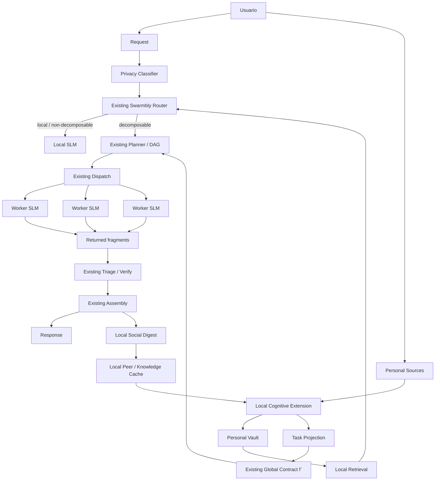
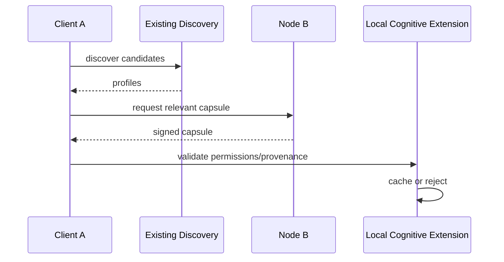
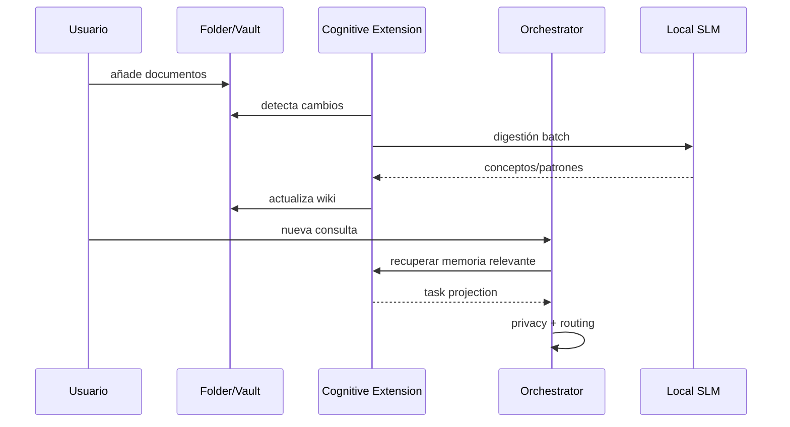
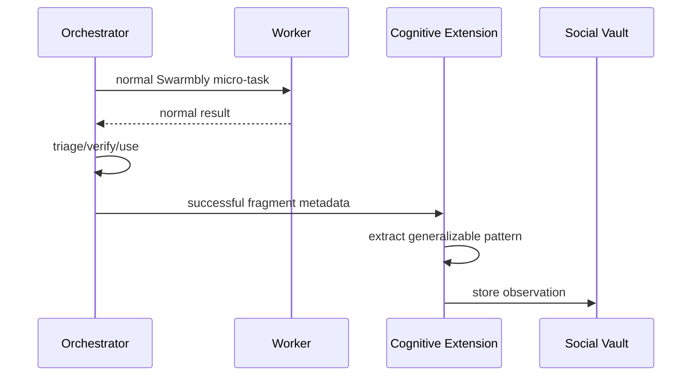
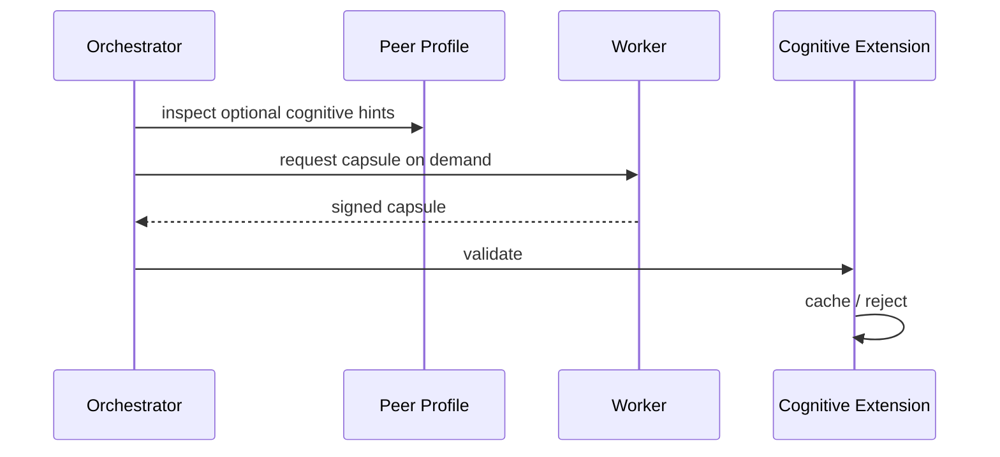

# Swarmbly Cognitive Extension
## Arquitectura local-first para memoria, aprendizaje personal y transferencia ligera de conocimiento sobre el protocolo real de Swarmbly

**Versión conceptual:** 0.4  
**Fecha:** 4 de octubre de 2026 (0.3: 3 de octubre; 0.2: 30 de septiembre de 2026)  
**Cambios en 0.4:** secciones 188–198 nuevas (ideas rescatadas R1–R7 de la fase exploratoria: transmisión cultural y conformismo, variación anclada, persistencia por rareza, capa epistémica local, distancia epistémica, respuesta plural, selección de adaptadores y política de aprendizaje; ejemplo guía "chuta" y conjunto canario; hipótesis H-C11–H-C15; arquitectura completa e invariantes I1–I8); notas en las secciones 21, 22, 39, 57, 63, 69, 95 y 167; conclusión renumerada como 199; referencias en la 200.  
**Cambios en 0.3:** secciones 180–187 nuevas (huecos G1–G6: hechos frente a pesos, sistemas de aprendizaje complementarios, colapso de modelos, verificación, genética de poblaciones e incentivo); notas de integración en las secciones 41, 43, 58, 82, 85, 106, 111, 155, 156, 162 y 165; conclusión renumerada como 188; referencias en la 189.  
**Estado:** propuesta de extensión; NO forma parte todavía del protocolo Swarmbly v0.2/v0.3  
**Documento reemplazante:** este texto sustituye la arquitectura cognitiva anterior, que introducía subsistemas innecesarios y no respetaba suficientemente la arquitectura actual de Swarmbly.

---

# 0. Propósito y corrección de arquitectura

Este documento desarrolla una posible capa de aprendizaje continuo para Swarmbly partiendo de una restricción fundamental:

> **La extensión cognitiva debe adaptarse a Swarmbly; Swarmbly no debe deformarse para alojar la extensión cognitiva.**

La arquitectura actual de Swarmbly ya define su núcleo:

- un **cliente/orquestador local**;
- uno o más modelos locales pequeños en el lado del cliente;
- **workers independientes**, cada uno ejecutando un SLM completo;
- fragmentación del **problema**, no del modelo;
- planificación mediante DAG;
- un contrato global `Γ`;
- clasificación de sensibilidad antes de enviar cualquier paquete;
- dispatch de micro-tareas;
- redundancia selectiva;
- triage;
- verificación;
- ensamblaje local;
- auditoría de coherencia;
- perfiles de workers;
- descubrimiento P2P y servicios de red deliberadamente mínimos.

La nueva propuesta no debe crear, por defecto:

- otro Knowledge Graph global;
- otro Compute Graph;
- otro sistema de routing;
- una red P2P social paralela;
- un servicio global de replicación;
- un trust engine independiente;
- una blockchain;
- entrenamiento distribuido continuo;
- gossip permanente entre nodos;
- un modelo global compartido;
- una base de datos global de identidad.

En su lugar, la propuesta introduce una **Local Cognitive Extension (LCE)**: una capa opcional que vive principalmente en el dispositivo del usuario y reutiliza los primitives de Swarmbly cuando necesita comunicarse con la red.

---

# 1. Arquitectura de Swarmbly que se debe preservar

## 1.1. Principio de funcionamiento

Swarmbly no intenta ejecutar un gran modelo partido entre máquinas.

Su unidad distribuida es el **trabajo semántico**.

```text
REQUEST
   ↓
CLIENT / ORCHESTRATOR
   ↓
ROUTER
   ↓
PLANNER
   ↓
DAG of semantic micro-tasks
   ↓
DISPATCH
   ↓
independent complete SLM workers
   ↓
RESULT FRAGMENTS
   ↓
TRIAGE / VERIFY
   ↓
ASSEMBLY
   ↓
RESPONSE
```

La red se cruza una vez por unidad de trabajo y no en cada token generado.

La extensión cognitiva debe respetar esa propiedad.

---

## 1.2. Roles existentes

### Client / Orchestrator

Responsable de:

- clasificación de privacidad;
- decisión de fragmentar o no;
- planificación;
- generación del contrato `Γ`;
- packing de contexto;
- selección de workers;
- dispatch;
- verificación;
- ensamblaje;
- auditoría.

### Worker

Responsable de:

- declarar su perfil;
- recibir una micro-tarea;
- ejecutarla con un modelo completo;
- devolver un resultado firmado;
- emitir telemetry / commitments requeridos.

### Network services

Deben permanecer mínimos:

- peer discovery;
- registry / reputation;
- credit accounting;
- audit sampling.

La extensión cognitiva no debe convertir esta capa mínima en una plataforma pesada.

---

# 2. Objetivo de la extensión cognitiva

La Local Cognitive Extension busca añadir cuatro capacidades:

1. **Memoria personal persistente.**
2. **Aprendizaje local controlado por el usuario.**
3. **Especialización progresiva de uno o varios SLM locales.**
4. **Transferencia ligera y opcional de conocimiento generalizable entre nodos.**

La tesis es:

> Cada nodo puede desarrollar una representación local y portable de lo que su usuario le ha enseñado, sin convertir ese conocimiento en una obligación de red ni en una copia completa del usuario.

Y, en una segunda etapa:

> Los nodos pueden aprender patrones útiles derivados de interacciones autorizadas con otros nodos, sin intercambiar modelos completos ni mantener una red social paralela.

---

# 3. Lo que cambia respecto a la propuesta anterior

## 3.1. Se elimina el Knowledge Graph global

No se necesita un grafo de conocimiento global.

Puede existir un grafo **local** derivado del vault del usuario, pero:

- vive en su máquina;
- puede ser implícito mediante links Markdown;
- puede representarse en SQLite;
- no requiere Neo4j;
- no requiere sincronización global.

---

## 3.2. Se elimina un Compute Graph paralelo

Swarmbly ya posee información de:

- recursos;
- modelos;
- RTT;
- desempeño;
- disponibilidad.

La extensión no necesita inventar otro plano global de cómputo.

---

## 3.3. Se elimina el “Social Mesh” como red independiente

Los nodos ya son peers dentro de Swarmbly.

Los “vecindarios cognitivos” se implementarán inicialmente como:

> **una caché local de afinidad hacia peers que el cliente ya descubre y utiliza.**

No se requiere un servicio central de comunidades.

---

## 3.4. Se elimina el gossip permanente

Un nodo no debe enviar periódicamente su memoria a los demás.

El intercambio de conocimiento debe ser:

- explícitamente permitido;
- pequeño;
- bajo demanda;
- relacionado con una tarea real;
- cacheable.

---

## 3.5. Se elimina el fine-tuning continuo obligatorio

Fine-tuning es opcional.

La mayoría del aprendizaje puede ocurrir mediante:

```text
Wiki
+
retrieval
+
task-specific context
+
small local profile
```

Solo una fracción estable del conocimiento debería convertirse en LoRA u otro adapter.

---

# 4. Principio arquitectónico: Local First, Network When Useful

La jerarquía propuesta:

```text
L0 — context of current request
L1 — local model
L2 — local personal memory
L3 — local social cache
L4 — existing Swarmbly workers
L5 — external sources, if user allows
```

Antes de consultar la red:

1. el nodo intenta resolver localmente;
2. recupera memoria personal;
3. recupera conocimiento social previamente cacheado;
4. si sigue siendo útil, utiliza el flujo normal de Swarmbly.

Esto reduce:

- tráfico;
- latencia;
- consumo;
- exposición de información;
- dependencia de nodos externos.

---

# 5. Vista general de la arquitectura corregida



Punto clave:

> **La extensión cognitiva se conecta al cliente/orquestador. No sustituye el flujo de Swarmbly.**

---

# 6. Local Cognitive Extension (LCE)

La LCE puede implementarse como una biblioteca o “sidecar” local del cliente.

No necesita ser un conjunto de microservicios.

Una implementación inicial podría ser un único proceso con módulos internos.

```text
Local Cognitive Extension
├── Source Watcher
├── Digestion Pipeline
├── Personal Vault
├── Retrieval Index
├── Cognitive Profile
├── Social Cache
├── Training Queue
└── Policy Manager
```

---

# 7. Personal Source Space

El usuario selecciona explícitamente qué fuentes puede aprender su nodo.

Ejemplo:

```text
~/SwarmblyBrain/
├── inbox/
├── knowledge/
├── style/
├── reference/
├── private/
└── shareable/
```

Cada carpeta puede tener una política distinta.

Ejemplo:

```yaml
knowledge:
  remember: true
  use_for_retrieval: true
  use_for_training: true
  share: false

style:
  remember: true
  use_for_training: true
  share: false

shareable:
  remember: true
  use_for_training: true
  share: true
```

---

# 8. Obsidian / Markdown como memoria legible

Una opción especialmente apropiada es utilizar Markdown como representación canónica.

Obsidian puede actuar como interfaz humana.

La arquitectura no debe depender de Obsidian como servicio.

```text
Personal Vault
├── self/
├── concepts/
├── terminology/
├── projects/
├── procedures/
├── sources/
├── social/
└── training/
```

Ventajas:

- portable;
- visible;
- editable;
- versionable;
- barato;
- independiente del modelo;
- compatible con Git;
- procesable sin base de datos pesada.

---

# 9. Digestión de información

Inspirado en enfoques tipo LLM-Wiki, la información no se almacena únicamente como chunks.

Pipeline:

```text
new source
   ↓
parse
   ↓
identify concepts
   ↓
extract relationships
   ↓
detect terminology
   ↓
identify preferences / style
   ↓
link with existing notes
   ↓
update Markdown
```

La digestión puede utilizar el mismo SLM local que ya posee el cliente.

No se necesita mantener otro modelo cargado permanentemente.

---

# 10. Política de carga de modelos

Una máquina limitada no debe tener cinco modelos residentes simultáneamente.

La arquitectura soporta varios modelos lógicos, pero los carga bajo demanda.

Ejemplo:

```text
Local model registry

orchestrator_model → model A
digest_model       → model A, different prompt
critic_model       → model B, only when needed
specialist_model   → optional
```

En hardware pequeño:

```text
one model
multiple roles
```

En hardware potente:

```text
multiple models
parallel roles
```

El protocolo no debe asumir una configuración concreta.

---

# 11. Tipos de memoria local

## 11.1. Personal semantic memory

Conocimiento que el usuario decidió enseñar.

```text
concepts
facts
terminology
methods
project knowledge
```

## 11.2. Preference memory

```text
preferred wording
format
language
tone
response length
coding conventions
```

## 11.3. Episodic memory

Opcional:

```text
past interactions
decisions
events
```

Debe utilizarse principalmente para retrieval, no para fine-tuning automático.

## 11.4. Social memory

Patrones derivados de interacciones autorizadas con la red.

Debe estar físicamente y lógicamente separado de:

```text
self/
```

---

# 12. Cognitive Profile

El nodo puede mantener un pequeño perfil local condensado.

Ejemplo:

```yaml
languages:
  es: primary
  en: fluent

style:
  technical: 0.84
  conversational: 0.73

preferred_terms:
  - "semantic fragmentation"

domains:
  distributed_ai: 0.82
  genomics: 0.91

response_preferences:
  explanations: detailed
```

Este archivo NO debe enviarse completo a la red.

---

# 13. Task Projection: la pieza que conecta memoria con Swarmbly

Para cada solicitud, la LCE genera una proyección mínima:

```text
Personal Cognitive State
       ↓
Task relevance filter
       ↓
Task Projection
```

Ejemplo:

```yaml
register: technical
preferred_terms:
  - semantic fragmentation

entities:
  Swarmbly: "Swarmbly"

style_anchor:
  precise and explanatory
```

---

# 14. Reutilización del contrato Γ

Una gran parte de la personalización ya cabe en campos que Swarmbly posee.

El `Γ` actual incluye conceptos como:

```text
objective
audience
register
format
lexicon
entities
style_seed
budget
```

La extensión debe proyectar la información personal relevante dentro de estos campos.

Ejemplo:

```text
Personal preference
        ↓
"technical but accessible"
        ↓
Γ.register
Γ.style_seed
```

Terminología:

```text
Personal Vault
   ↓
preferred terminology
   ↓
Γ.lexicon
```

Nombres:

```text
Personal Vault
   ↓
canonical entities
   ↓
Γ.entities
```

Esto evita añadir un nuevo “personalization packet”.

---

# 15. Regla del Context Budget

La memoria personal compite con el presupuesto de contexto.

Por tanto, no debe enviarse indiscriminadamente.

```text
relevant memory
+
Γ
+
fragment context
≤
allowed context budget
```

La personalización debe ser una compresión relevante, no una biografía completa.

---

# 16. Privacidad

La extensión debe ejecutarse antes del dispatch.

Orden:

```text
request
↓
personal retrieval
↓
sensitivity classification
↓
determine lane
↓
network decision
```

Si la memoria recuperada eleva la sensibilidad:

```text
PUBLIC → SANITISABLE
```

o:

```text
SANITISABLE → SENSITIVE / LOCAL
```

el tier debe elevarse.

Nunca reducirse automáticamente.

---

# 17. No aprender automáticamente del tráfico de otros usuarios

Un worker puede ver un fragmento de una solicitud.

Eso NO significa que tenga derecho a convertirlo en memoria permanente.

Regla por defecto:

```text
incoming worker task
→ execute
→ return result
→ discard content
```

El worker no debe entrenarse ni actualizar su wiki con el contenido de la tarea por defecto.

---

# 18. Opt-in explícito para aprendizaje compartido

Una futura extensión puede permitir:

```yaml
learning_permission:
  retain_generalized: true
  retain_raw: false
  redistribute: false
```

Pero el default debe ser:

```text
NO RETENTION
```

Esto evita convertir el voluntariado computacional en recolección involuntaria de datos.

---

# 19. Aprendizaje desde los resultados que recibe el propio cliente

El cliente sí puede analizar los resultados de sus propias solicitudes.

Flujo:

```text
returned fragment
↓
normal Swarmbly verification
↓
used in response?
↓
local social digest
```

El Social Digest puede extraer:

- terminología nueva;
- estilos culturales generales;
- formas de explicación;
- patrones de dominio;
- candidatos a conocimiento.

Sin conservar necesariamente el fragmento completo.

---

# 20. El aprendizaje social no prueba verdad

Una corrección epistemológica esencial:

```text
many models repeat X
```

NO implica:

```text
X is true
```

La red puede utilizar repetición para medir:

- prevalencia;
- estabilidad;
- recurrencia;
- diversidad de expresión.

No como prueba automática de factualidad.

Esto es especialmente importante porque Swarmbly ya distingue diversidad / divergencia de veracidad.

---

# 21. Estados del conocimiento social

```text
OBSERVED
   ↓
REPEATED
   ↓
GENERALIZED
   ↓
USEFUL
   ↓
LOCAL-CACHED
   ↓
OPTIONALLY TRAINABLE
```

“Repeated” significa visto múltiples veces.

No significa “verified”.


**Nota (v0.4).** Estos estados describen la prevalencia de un patrón entre pares y no su soporte epistémico. Los estados de madurez de la sección 192 (RAW a TRAINABLE) son independientes y son los únicos que deciden qué puede entrenarse.

---

# 22. Social Cache

La Social Cache es local y pequeña.

Ejemplo:

```yaml
concept: "chuta"

observations:
  independent_nodes: 5
  model_families: 3

pattern:
  region: Ecuador
  type: informal_interjection

status: observed
confidence_in_pattern: 0.83

truth_status: unverified
```

Aquí se separan:

```text
pattern confidence
```

de:

```text
factual confidence
```


**Nota (v0.4).** El recuento de nodos y familias es una etiqueta de prevalencia, no un criterio de adopción: usarlo para decidir qué se cachea, consolida o entrena implementaría el sesgo conformista de la sección 189. La sección 196 recorre este ejemplo de extremo a extremo y lo convierte en el conjunto canario.

---

# 23. Peer Affinity Cache

Esta es la implementación práctica de los “vecindarios cognitivos”.

No se necesita una topología global adicional.

Cada cliente mantiene localmente algo como:

```yaml
node_id: ...

observed_domains:
  genomics: 0.81
  spanish: 0.76

local_affinity:
  genomics: 0.88

historical_utility:
  extraction: 0.92

last_interaction: ...
```

---

# 24. Affinity no es reputation

No deben mezclarse.

### Existing reputation

Responde:

```text
¿este worker ejecuta correctamente y pasa audits?
```

### Local affinity

Responde:

```text
¿este worker suele ser útil para mis tareas de este tipo?
```

### Epistemic provenance

Responde:

```text
¿qué soporte tiene esta información?
```

Tres propósitos diferentes.

Tres métricas distintas.

---

# 25. Cognitive Neighborhood como efecto emergente

Un “vecindario” existe cuando:

```text
Client A
```

empieza a reutilizar determinados peers para:

```text
domain X
language Y
task type Z
```

por su historial local.

No necesita:

- membresía global;
- consenso;
- cluster service;
- sincronización.

---

# 26. Formación de vecindarios sin tráfico adicional

El cliente ya recibe:

- node IDs;
- profile;
- model family;
- RTT;
- audit history;
- resultados.

Puede construir afinidad usando esa información.

Por tanto:

```text
existing traffic
→ local affinity
```

en lugar de:

```text
new gossip traffic
→ global graph
```

---

# 27. Posible extensión mínima del Node Profile

Si en el futuro se demuestra útil, el profile del worker puede añadir un bloque opcional.

Ejemplo:

```json
{
  "cognitive": {
    "v": "0.1",
    "domains": ["genomics", "robotics"],
    "languages": ["es", "en"],
    "share_mode": "metadata",
    "capsules": true
  }
}
```

Debe ser:

- opcional;
- pequeño;
- coarse-grained;
- controlado por el usuario;
- no identificador;
- compatible con clientes que lo ignoren.

---

# 28. No anunciar la identidad del usuario

Nunca:

```json
{
  "profession": "...",
  "nationality": "...",
  "employer": "...",
  "personal_interests": [...]
}
```

por defecto.

El profile debe representar capacidades del nodo, no una biografía.

---

# 29. Heterogeneidad como activo

Swarmbly ya se beneficia de distintas familias de modelos.

La capa cognitiva debe preservar también:

- diversidad de corpus;
- diversidad cultural;
- diversidad terminológica;
- diversidad de adapters.

Objetivo:

```text
share knowledge
≠
make every node identical
```

---

# 30. Transferencia de conocimiento: no compartir pesos por defecto

Un LoRA puede ser:

- grande;
- específico de una familia;
- difícil de auditar;
- capaz de transportar comportamiento no deseado.

Por tanto, la unidad preferida debe ser una abstracción pequeña.

---

# 31. Cognitive Capsule

Una cápsula cognitiva es una unidad pequeña de conocimiento generalizable.

Ejemplo:

```yaml
id: cc_01923
schema: 0.1

domain: linguistics
topic: ecuadorian_spanish

summary:
  "Chuta is commonly used as an informal interjection..."

examples:
  - "..."

provenance_class:
  user_curated_public

support:
  local_sources: 3

permissions:
  cache: true
  redistribute: true
  train: false

ttl_days: 180
```

---

# 32. Qué NO debe contener una cápsula

Por defecto:

- documentos originales;
- conversaciones privadas;
- nombres personales;
- embeddings derivados de material privado;
- historiales completos;
- prompts de terceros;
- adapters completos;
- secretos;
- datos identificables.

---

# 33. Capsule Manifest

Para evitar enviar cápsulas que nadie necesita, un nodo puede anunciar solo metadata.

Ejemplo:

```yaml
capsule_topics:
  - ecuadorian_spanish
  - population_genomics

digest:
  bloom_or_hash: ...
```

La cápsula completa se solicita únicamente cuando sea relevante.

---

# 34. Pull, no gossip

Regla de diseño:

```text
DON'T PUSH EVERYTHING
```

Preferir:

```text
advertise tiny capability hint
↓
client identifies relevance
↓
request capsule
```

Así el conocimiento cruza la red solamente cuando existe demanda.

---

# 35. Flujo de una cápsula



No se introduce una red adicional.

---

# 36. ¿Cómo se preserva conocimiento si un nodo desaparece?

La respuesta barata es:

> **replicación inducida por uso.**

Cuando una cápsula es útil:

```text
Node A owns capsule
   ↓
Client B requests it
   ↓
B caches it
   ↓
Client C requests it
   ↓
C caches it
```

El conocimiento más utilizado adquiere copias naturalmente.

---

# 37. Traffic-induced persistence

Esto se aproxima a la intuición original:

```text
more useful traffic
→ more validated uses
→ more caches
→ higher survival probability
```

Pero sin necesitar un daemon de replicación global.

---

# 38. Qué ocurre cuando muere el nodo de origen

Si la cápsula permitió redistribución:

```text
origin disappears
↓
cached copies remain
```

La provenance puede registrar:

```text
origin unavailable
```

sin destruir el contenido.

---

# 39. Conocimiento raro

El mecanismo inducido por uso favorece conocimiento popular.

El conocimiento raro necesita una opción adicional.

Una fase posterior podría introducir:

```text
preserve=true
```

para cápsulas explícitamente elegidas por el usuario.

Esas cápsulas pueden solicitar un número pequeño de réplicas.


**Nota (v0.4).** La sección 191 da forma a esta opción como persistencia ponderada por rareza (selección dependiente de la frecuencia negativa), limitada a cápsulas preservadas, ancladas y con presupuesto de réplica acotado.

---

# 40. Replication factor separado

Si se introduce, debe tener un parámetro propio:

```text
r_memory
```

No debe reutilizar:

```text
k_avail
k_verif
k_epist
```

porque resuelve otro problema.

---

# 41. r_memory debe ser pequeño

Ejemplo conceptual:

```text
default = 0
user-selected preservation = 2 or 3
```

Nunca:

```text
replicate entire vault
```


**Nota (v0.3).** La sección 185 deriva r_memory de una tolerancia declarada en lugar de fijarlo a ojo. Con la vida media de 91 días y reparación semanal, la probabilidad anual de perder una cápsula preservada es cercana al 25 % con r = 2 y al 2.1 % con r = 3, de modo que los valores "2 or 3" no son equivalentes: r = 3 pasa a ser el mínimo para la preservación elegida por el usuario, con copias en operadores distintos.

---

# 42. Entrenamiento local

La ruta preferida:

```text
raw information
↓
wiki
↓
retrieval
↓
stable patterns
↓
training queue
↓
optional LoRA
```

---

# 43. Qué merece fine-tuning

Buenos candidatos:

- vocabulario estable;
- estilo;
- procedimientos repetidos;
- patrones de código;
- formatos;
- hábitos lingüísticos.

Malos candidatos:

- noticias;
- precios;
- fechas;
- tareas abiertas;
- hechos cambiantes;
- conocimiento incierto.


**Nota (v0.3).** La lista anterior queda respaldada y convertida en regla en la sección 181: la recuperación supera al ajuste fino para incorporar conocimiento [5], y el ajuste sobre hechos nuevos aumenta la tendencia a alucinar [6]. Los hechos permanecen en la wiki; a los pesos van solo patrones de comportamiento.

---

# 44. Trainability Score

Una heurística local:

```text
trainability =
stability
× repeated_use
× user_importance
× confidence
× privacy_permission
÷ update_frequency
```

No requiere red.

---

# 45. Consolidation Cycle

Puede ejecutarse cuando:

- el dispositivo está idle;
- está conectado a corriente;
- existe suficiente material nuevo;
- el usuario lo permite.

```text
new notes
↓
cluster
↓
summarize stable patterns
↓
update wiki
↓
optional training candidate
```

---

# 46. No “entrenar cada noche” por obligación

El sistema debe ser event-driven.

Ejemplo:

```text
if new_trainable_examples < threshold:
    do nothing
```

Esto reduce gasto.

---

# 47. Model-independent cognition

La parte más valiosa debe permanecer en:

```text
Markdown
+
metadata
+
examples
+
retrieval index
```

No en los pesos.

Así:

```text
Model A
→ replaced by Model B
```

no destruye la identidad cognitiva.

---

# 48. Adapters como caché de comportamiento

Un LoRA puede verse como:

```text
compressed behavioral cache
```

No como fuente canónica de conocimiento.

La fuente canónica sigue siendo el vault.

---

# 49. Multi-SLM local opcional

El usuario puede tener:

```text
1 model
```

o:

```text
orchestrator
+
specialist
+
critic
```

o más.

Pero la LCE no requiere un número fijo.

---

# 50. Local model specialization

Ejemplo:

```text
Model A
orchestration + conversation

Model B
coding

Model C
science
```

Cada modelo puede utilizar:

```text
same vault
different retrieval policy
different adapter
```

---

# 51. Model selection remains local

No hace falta anunciar a la red toda la arquitectura interna.

Externamente, cuando el nodo actúa como worker, declara únicamente lo requerido por el profile.

---

# 52. Aprendizaje entre modelos locales

Los SLM locales pueden aprender indirectamente a través del mismo vault.

```text
Model A discovers pattern
↓
writes structured note
↓
Model B later retrieves it
```

Esto evita sincronizar pesos entre modelos.

---

# 53. Aprendizaje entre nodos

También debe priorizar representación externa:

```text
Node A
↓
capsule
↓
Node B vault/social
↓
retrieval
```

antes de:

```text
Node A weights
↓
Node B weights
```

---

# 54. Transferencia de patrones de entrenamiento

Si se quiere preservar “lo que aprendió el modelo”, compartir:

```text
training examples
style summary
procedure summary
preference abstraction
```

es más portable que compartir adapters completos.

---

# 55. Training Capsule

Opcionalmente:

```yaml
type: training_pattern

instruction:
  "Explain X..."

preferred_response_pattern:
  "..."

purpose:
  terminology

model_independent: true
```

El receptor puede:

- usarla como retrieval;
- convertirla en dataset;
- ignorarla.

---

# 56. Adapter transfer como excepción

Puede ser útil cuando:

```text
same model family
same version
same quantization assumptions
```

Pero debe ser una optimización posterior.

No el mecanismo base.

---

# 57. Diversidad y anti-homogeneización

Un nodo no debe entrenar automáticamente todo lo que recibe.

La secuencia debe ser:

```text
receive
↓
cache
↓
use
↓
observe benefit
↓
possibly consolidate
↓
possibly train
```

Esto hace que el conocimiento social tenga una barrera antes de convertirse en comportamiento.


**Nota (v0.4).** Esta secuencia es la que evita el conformismo: la adopción se decide por beneficio observado y no por cuántos pares repiten algo (sección 189).

---

# 58. Diversity Budget

Una política local puede limitar:

```text
maximum fraction of training data derived from peers
```

Ejemplo conceptual:

```text
personal = dominant
social = minority
```

Los valores concretos deben medirse.


**Nota (v0.3).** La sección 183 convierte "social = minority" en una regla de acumulación derivada de la literatura sobre colapso de modelos, y la sección 185 da al presupuesto una banda inicial de migración (aproximadamente 0.5 ≤ Nm ≤ 2.25, equivalente a 0.1 ≤ F_ST ≤ 0.33) que el experimento social debe confirmar.

---

# 59. Cultura e identidad

El sistema puede aprender:

```text
"this expression is common in Ecuador"
```

pero no:

```text
"I am Ecuadorian"
```

La información cultural externa pertenece a:

```text
social/culture/
```

no:

```text
self/identity/
```

---

# 60. Clusters de identidad: redefinición

En lugar de clusters de “personas”, utilizar:

> **clusters de afinidad cognitiva.**

Ejemplos:

```text
Spanish terminology
robotics
genomics
legal writing
Quebec French
Ecuadorian colloquial Spanish
```

Esto reduce exposición personal.

---

# 61. Emergent neighborhoods

Los clusters pueden emerger de:

```text
routing history
+
task usefulness
+
declared coarse domains
+
model diversity
```

No requieren una clasificación global permanente.

---

# 62. Posible affinity score

Localmente:

```text
Affinity(peer, domain) =
a × successful_tasks
+ b × useful_fragment_rate
+ c × domain_match
+ d × diversity_value
- e × latency_penalty
```

El score:

- no se publica necesariamente;
- no es reputación global;
- puede decaer;
- puede reiniciarse.

---

# 63. Exploration

Si siempre se utilizan los mismos vecinos:

```text
echo chamber
```

Por eso el routing puede reservar una pequeña fracción para nuevos peers.

Ejemplo conceptual:

```text
mostly known useful nodes
+
occasionally unexplored compatible nodes
```


**Nota (v0.4).** La sección 194 concreta esta reserva como una réplica de exploración asignada a un par de baja afinidad local en las tareas que admiten réplicas.

---

# 64. Reutilizar la diversidad de modelo existente

Para una tarea crítica:

Swarmbly ya puede priorizar familias distintas.

La LCE puede añadir:

```text
different learned backgrounds
```

como señal opcional.

Pero nunca debe reducir la diversidad a una única “identidad óptima”.

---

# 65. Cognitive hints en routing

En una versión futura, el candidate filter podría considerar:

```text
capability
tier
RTT
reputation
model-family diversity
+
optional domain hints
```

Nada más es necesario para un MVP.

---

# 66. No construir un “Knowledge Router” independiente

La selección de nodos cognitivos debe incorporarse al dispatch existente.

Incorrecto:

```text
Swarmbly router
+
knowledge router
+
social router
```

Correcto:

```text
one routing pipeline
with optional cognitive features
```

---

# 67. No construir un “Trust Engine” independiente

Swarmbly ya posee mecanismos de reputación y verificación para ejecución.

Para conocimiento:

- provenance local;
- user validation;
- external sources;
- independent evidence.

No mezclar reputación de cómputo con autoridad epistemológica.

---

# 68. Provenance local

Cada nota derivada puede mantener:

```yaml
origin:
  local_source: ...
  peer_node: ...
  capsule_id: ...

created_at: ...
derived_by_model: ...
```

---

# 69. Lineage ligera

No se necesita un ledger.

Una cápsula puede incluir:

```yaml
parent:
  cc_01923

revision:
  3
```

y una firma.

Eso es suficiente para rastreo básico.


**Nota (v0.4).** La sección 190 amplía la lineage con `delta_evidence`: una revisión solo es un descendiente legítimo si declara evidencia humana nueva; sin ella es una reformulación y no se redistribuye.

---

# 70. La firma no prueba verdad

Una firma demuestra:

```text
who sent this object
```

No:

```text
this object is correct
```

La arquitectura debe mantener esa separación.

---

# 71. Cost model de la extensión

## 71.1. Costo local mínimo

```text
Markdown storage
SQLite metadata
small embedding index
periodic digestion
```

Muy inferior al costo de inference continua.

## 71.2. Costo de red

Por defecto:

```text
0 additional transfer
```

porque social learning puede derivarse de resultados que ya regresan al cliente.

## 71.3. Cognitive profile

Añade únicamente metadata pequeña si está habilitado.

## 71.4. Capsules

Se descargan solo bajo demanda.

## 71.5. Fine-tuning

Opcional y batch.

---

# 72. Hardware accessibility tiers

La función cognitiva debe degradar elegantemente.

## Tier C0 — Basic Swarmbly

```text
no persistent cognitive layer
```

## Tier C1 — Memory

```text
Markdown + retrieval
```

## Tier C2 — Digestion

```text
automatic wiki maintenance
```

## Tier C3 — Social cache

```text
peer affinity + capsules
```

## Tier C4 — Fine-tuning

```text
local adapters
```

Ningún tier superior debe ser obligatorio para participar.

---

# 73. Esta jerarquía preserva democratización

Un portátil modesto puede ser:

```text
C1/C2
```

Una workstation:

```text
C4
```

Ambos siguen formando parte de Swarmbly.

La red no debe premiar exclusivamente al usuario que puede entrenar modelos localmente.

---

# 74. Uso del mismo SLM para digestión

En equipos pequeños:

```text
idle time
↓
same local SLM
↓
digest inbox
```

No es necesario comprar otro modelo o GPU.

---

# 75. Embeddings

Puede utilizarse un embedding model pequeño.

Su trabajo:

- semantic retrieval;
- deduplication;
- link suggestions.

No necesita formar parte de la red.

---

# 76. Obsidian Graph

El grafo visual de Obsidian puede ser útil para el usuario.

Pero no es una dependencia de Swarmbly.

La semántica real vive en:

```text
Markdown links
+
metadata
```

---

# 77. Workflow local completo



---

# 78. Workflow social completo



No existe transferencia adicional en este flujo.

---

# 79. Capsule flow opcional



---

# 80. Consolidación por tráfico

La intuición “entre más interacción, más fuerte la red” puede formularse sin analogía neuronal:

```text
repeated useful interaction
→ more local evidence about peer utility
→ higher probability of future selection
→ more shared observations
→ more cached knowledge
```

Esto sí es implementable y medible.

---

# 81. Qué significa “consolidación” de una relación

No es una sinapsis literal.

Es:

```text
higher local affinity score
+
larger useful cache
+
better routing history
```

---

# 82. Failure mode: echo chamber

Si afinidad domina completamente el routing:

```text
same peers
→ same patterns
→ lower diversity
```

Mitigación:

```text
exploration
+
family diversity
+
cap on affinity influence
```


**Nota (v0.3).** La sección 185 identifica esta cámara de eco con el modo de fallo de la regla de Hebb sin normalizar y da la forma de la mitigación: la afinidad decae con el tiempo y se normaliza por dominio, por analogía con la regla de Oja y el escalado sináptico.

---

# 83. Failure mode: social poisoning

Si un peer produce patrones falsos pero plausibles:

```text
social cache contamination
```

Mitigación:

- no equiparar repetition con truth;
- mantener provenance;
- separar observed de verified;
- no auto-train immediately;
- usar user/source validation.

---

# 84. Failure mode: identity leakage

Un cognitive profile demasiado detallado puede identificar a una persona.

Mitigación:

```text
coarse categories
user control
no personal biography
minimal advertisement
```

---

# 85. Failure mode: training homogenization

Si los nodes entrenan con las mismas cápsulas:

```text
network diversity ↓
```

Mitigación:

- retrieval before training;
- social training cap;
- no global adapter;
- random exploration;
- local priorities.


**Nota (v0.3).** La homogeneización es una forma del colapso de modelos descrito en la sección 183, cuyo primer síntoma es la desaparición de las colas de la distribución. La mitigación queda especificada allí como acumulación, trazabilidad a origen humano y prohibición de entrenar con derivados de segunda generación.

---

# 86. Failure mode: cost creep

Cada “feature” puede introducir background compute.

Por eso:

```text
no periodic global sync
no mandatory retraining
no mandatory clustering service
no always-on knowledge gossip
```

---

# 87. Failure mode: context inflation

Agregar demasiada memoria a `Γ` incrementa el contexto enviado a cada worker.

Mitigación:

```text
Task Projection
```

Debe seleccionar solo la fracción necesaria.

---

# 88. Failure mode: privacy amplification

Personalización puede revelar más sobre el usuario que el prompt original.

Mitigación:

```text
re-run sensitivity classification
after memory injection
```

No solo antes.

---

# 89. Doble privacy classification

Propuesta:

```text
request
↓
initial classification
↓
local retrieval
↓
task projection
↓
final classification
↓
dispatch
```

La segunda clasificación captura riesgos introducidos por la memoria.

---

# 90. Fine-tuning privacy

Los adapters personales:

```text
local-only by default
```

porque pueden memorizar trazas del corpus.

---

# 91. Capsule privacy

Una cápsula solo puede generarse desde contenido cuyo policy permita:

```text
generalize
```

y:

```text
share
```

Ambos.

---

# 92. License / redistribution metadata

Las cápsulas deberían incluir:

```yaml
redistribution:
  allowed: true
  license: ...
```

para no convertir la red en un mecanismo de copia no autorizada.

---

# 93. User Control UI

El usuario debería poder ver:

```text
What my local AI learned
What came from my files
What came from peers
What can be shared
What has been shared
What is training my adapters
```

---

# 94. Corrección

El usuario debe poder decir:

```text
This is wrong
```

y la LCE:

```text
lower confidence
mark corrected
invalidate training example
```

---

# 95. Forget

Eliminar una fuente debe:

```text
remove source
↓
mark derived notes
↓
rebuild affected summaries
↓
remove training candidates
```

Si ya se produjo un adapter:

```text
mark adapter as affected
```

y permitir regenerarlo.


**Nota (v0.4).** El olvido en la wiki es inmediato, pero en un adaptador ya entrenado el único olvido verificable es regenerarlo sin los ejemplos afectados (sección 192), y si la wiki vive en Git la historia afectada debe reescribirse. La sección 195 hace de la regeneración la operación normal.

---

# 96. Qué no puede borrarse globalmente

Una cápsula previamente compartida con permiso de redistribución puede existir en caches externas.

Por eso la UI debe diferenciar:

```text
delete local
```

de:

```text
network revocation request
```

La segunda no puede garantizar borrado en peers no confiables.

---

# 97. Backups personales

La supervivencia del “mini-cerebro” privado debe resolverse primero con backup del usuario.

Ejemplo:

```text
encrypted local backup
external drive
user-controlled cloud
```

No mediante replicación automática a strangers.

---

# 98. Dos conceptos de supervivencia

### Personal continuity

Preserva:

- identity;
- private memory;
- adapters.

Se resuelve con backup.

### Cultural / network continuity

Preserva:

- shareable abstractions;
- capsules;
- public training patterns.

Se resuelve con cache distribuida.

No mezclarlos.

---

# 99. Diseño de archivo local

```text
~/.swarmbly/
├── config/
├── models/
├── cognitive/
│   ├── vault/
│   │   ├── self/
│   │   ├── knowledge/
│   │   ├── social/
│   │   └── training/
│   ├── index.sqlite
│   ├── vectors/
│   ├── affinity.sqlite
│   └── policy.yaml
├── adapters/
└── runtime/
```

---

# 100. SQLite antes de infraestructura pesada

Para el MVP:

```text
SQLite
```

puede manejar:

- metadata;
- observations;
- affinity;
- indexes;
- training queue.

No se necesita:

```text
distributed database
```

---

# 101. Event loop simple

Ejemplo:

```text
FILE_CHANGED
RESULT_USED
CAPSULE_RECEIVED
USER_CORRECTION
IDLE_AVAILABLE
```

Un proceso local responde a estos eventos.

---

# 102. Minimal local pseudocode

```python
def handle_user_request(request):

    first_lane = classify_privacy(request)

    memory = cognitive.retrieve(request)

    projection = cognitive.project(memory, request)

    enriched_request = apply_projection(request, projection)

    final_lane = classify_privacy(enriched_request)

    lane = max_sensitivity(first_lane, final_lane)

    return swarmbly_orchestrator.run(
        request=request,
        task_projection=projection,
        lane=lane
    )
```

---

# 103. Social observation pseudocode

```python
def on_fragment_used(fragment, worker_profile):

    if fragment.task_lane != "PUBLIC":
        return

    pattern = extract_general_pattern(fragment)

    if not pattern:
        return

    social_cache.observe(
        pattern=pattern,
        node_id=worker_profile.node_id,
        model_family=worker_profile.model_family
    )
```

Esto aún debería requerir política de usuario antes de retener contenido derivado.

---

# 104. Affinity pseudocode

```python
def update_affinity(peer, domain, outcome):

    score = affinity.get(peer, domain)

    score = decay(score)

    score += utility(outcome)
    score += diversity_bonus(peer)

    affinity.set(peer, domain, score)
```

---

# 105. Capsule retrieval pseudocode

```python
def maybe_request_capsule(query, peer):

    topics = peer.cognitive_topics

    if not relevant(query, topics):
        return None

    capsule = request_capsule(peer, query)

    if not verify_signature(capsule):
        return None

    if not policy.accepts(capsule):
        return None

    return capsule
```

---

# 106. No automatic re-sharing

```text
receive capsule
```

no implica:

```text
redistribute capsule
```

La redistribución depende de:

- permissions;
- provenance;
- local policy.


**Nota (v0.3).** Esta regla es la que corta la recursión que produce el colapso de modelos (sección 183); deja de ser una preferencia y pasa a ser una restricción del diseño.

---

# 107. Conexión con `k_epist`

Las cápsulas cognitivas NO sustituyen `k_epist`.

`k_epist` sirve para obtener respuestas diversas a la misma micro-tarea.

El social cache sirve para aprendizaje longitudinal.

Son propósitos diferentes.

---

# 108. Conexión con divergence

La divergencia de respuestas puede producir:

```text
interesting social observations
```

pero no debe convertirse automáticamente en:

```text
truth labels
```

---

# 109. Conexión con model-family diversity

Un patrón observado en:

```text
3 nodes
```

pero todos con:

```text
same model family
```

es menos independiente que un patrón observado en:

```text
3 different families
```

Esto puede afectar “pattern stability”, no verdad.

---

# 110. Client as cognitive owner

La arquitectura mantiene una consecuencia importante de Swarmbly:

> **El cliente es la unidad que conserva el estado.**

Los workers siguen siendo relativamente stateless respecto de las solicitudes.

Esto simplifica:

- privacidad;
- reproducibilidad;
- costo;
- debugging.

---

# 111. Workers cognitivos opcionales

Un worker puede tener su propia LCE para su usuario.

Pero cuando trabaja para otro cliente:

```text
personal brain
```

y:

```text
worker execution
```

deben permanecer separados.


**Nota (v0.3).** La separación es obligatoria, no solo prudente. La sección 184 muestra que un worker que sirve con su adaptador personal falla la verificación de capa 1 o tiene que publicar el adaptador, y que el entrenamiento con cápsulas compartidas puede correlacionar errores entre familias distintas. La regla es servir siempre el modelo base.

---

# 112. Sandboxing conceptual

```text
User-local cognitive state
        ║
        ║ boundary
        ║
Remote micro-task execution
```

La tarea de otra persona no entra automáticamente al cerebro personal del worker.

---

# 113. Modo “Share Expertise”

El usuario puede permitir que su nodo exponga una abstracción de ciertas áreas.

Ejemplo:

```yaml
share_expertise:
  - population_genomics
  - spanish_language
```

Esto ayuda al routing sin publicar la wiki.

---

# 114. Expertise no implica autoridad

El campo significa:

```text
this node opts to serve this domain
```

No:

```text
this node is objectively expert
```

El desempeño real se aprende mediante resultados.

---

# 115. Knowledge learned vs knowledge declared

Mantener separado:

```text
declared capability
```

de:

```text
observed utility
```

El primero viene del profile.

El segundo vive en affinity local.

---

# 116. Cognitive neighborhood example

```text
Client
│
├── Peer A
│   └── useful: genomics
│
├── Peer B
│   └── useful: Spanish cultural terminology
│
├── Peer C
│   └── useful: code
│
└── exploration peers
```

No se requiere que A, B y C sepan que forman un “vecindario”.

---

# 117. Organic cluster emergence

Si muchos clientes observan patrones similares:

```text
the network behaves as if clusters exist
```

aunque no exista una tabla global:

```text
cluster_membership
```

Esto es más barato y más descentralizado.

---

# 118. Cuando sí podría justificarse un índice de cluster

Solo si experimentos muestran que:

```text
local discovery cost
```

se vuelve una limitación.

Antes de eso:

```text
do not build it
```

---

# 119. Arquitectura de costo mínimo

MVP cognitivo:

```text
1 local SLM
1 embedding model
Markdown vault
SQLite
existing Swarmbly client
```

Eso es suficiente.

---

# 120. MVP 1 — Personal memory

Objetivo:

```text
folder
→ digest
→ wiki
→ retrieval
→ improved local answer
```

Sin red cognitiva.

---

# 121. MVP 2 — Personalization through Γ

Objetivo:

```text
personal preferences
→ task projection
→ Γ
→ distributed workers preserve user's terminology/style
```

Esta prueba es especialmente importante porque reutiliza un primitive existente.

---

# 122. MVP 3 — Social observation

Objetivo:

```text
normal returned fragments
→ general patterns
→ local social cache
```

Cero mensajes nuevos.

---

# 123. MVP 4 — Peer affinity

Objetivo:

```text
routing history
→ local affinity
→ improved worker selection
```

Medir si realmente mejora:

- fragment quality;
- latency;
- coherence;
- cost.

---

# 124. MVP 5 — Cognitive capsules

Solo después.

Objetivo:

```text
tiny optional knowledge object
→ on-demand transfer
→ cache
```

Medir overhead.

---

# 125. MVP 6 — Traffic-induced persistence

Experimento:

```text
Node A owns capsule X
B requests X
C requests X
A disappears
```

Pregunta:

```text
Can B/C still serve X?
```

---

# 126. MVP 7 — Fine-tuning

Finalmente:

```text
stable local vault
→ small training set
→ LoRA
```

Comparar contra:

```text
retrieval-only baseline
```

Si LoRA no mejora suficientemente, no usarlo.

---

# 127. No dar por supuesto que fine-tuning gana

La prueba correcta:

```text
RAG / task projection
vs
RAG + LoRA
```

Medir:

- quality;
- memory;
- latency;
- energy;
- catastrophic forgetting.

---

# 128. Métricas locales

- recall de conocimiento;
- precisión de preferencias;
- task relevance;
- tokens añadidos a `Γ`;
- tiempo de digestión;
- storage growth.

---

# 129. Métricas de red

- bytes adicionales por request;
- capsule hit rate;
- affinity routing gain;
- privacy incidents;
- capsule reuse;
- survival after origin loss.

---

# 130. Métrica crítica: Cognitive Overhead

Definir:

```text
Ω_cog =
additional compute
+
additional network bytes
+
additional local storage I/O
```

La extensión solo debería aceptarse si produce beneficio por encima de Ω_cog.

---

# 131. Principio propuesto: P12

Si esta extensión llegara al protocolo, una posible regla sería:

> **P12 — Learn locally first; transmit only the abstraction that earns its network cost.**

No es parte del whitepaper actual.

Es una propuesta coherente con su filosofía.

---

# 132. Principio propuesto: P13

> **P13 — Personal memory is state; worker execution is work. Do not confuse them.**

Esto preserva la separación entre:

- cliente stateful;
- worker execution.

---

# 133. Principio propuesto: P14

> **P14 — Repetition measures prevalence, not truth.**

Evita que aprendizaje social se convierta en consenso ingenuo.

---

# 134. Principio propuesto: P15

> **P15 — Preserve diversity before optimizing convergence.**

Porque la heterogeneidad es útil para selección.

---

# 135. Principio propuesto: P16

> **P16 — Shared cognition must be optional and backwards-compatible.**

Un nodo sin LCE sigue siendo un worker Swarmbly perfectamente válido.

---

# 136. Flujo end-to-end corregido

```text
USER
 ↓
LOCAL REQUEST
 ↓
retrieve relevant personal memory
 ↓
create small Task Projection
 ↓
privacy classification
 ↓
existing Swarmbly router
 ├── non-decomposable → local / single capable node
 └── decomposable
       ↓
    planner / DAG
       ↓
    Γ incorporates only relevant style/lexicon/entities
       ↓
    existing candidate filtering
       ↓
    optional local affinity influences ranking
       ↓
    normal workers
       ↓
    returned fragments
       ↓
    normal triage / verification / assembly
       ↓
    response
       ↓
    optional local social digest
       ↓
    personal/social cache update
```

La red principal sigue siendo Swarmbly.

---

# 137. Flujo de aprendizaje longitudinal

```text
USER SOURCES
  ↓
LOCAL WIKI
  ↓
LOCAL RETRIEVAL
  ↓
LOCAL SLM BEHAVIOR
  ↓
STABLE PATTERNS
  ↓
OPTIONAL ADAPTER
```

Separadamente:

```text
SWARMBLY INTERACTIONS
  ↓
SOCIAL OBSERVATIONS
  ↓
LOCAL SOCIAL CACHE
  ↓
REPEATED USE
  ↓
OPTIONAL GENERALIZATION
  ↓
OPTIONAL CAPSULE
```

---

# 138. ¿Dónde está el “mini-cerebro”?

No está en un solo modelo.

Es:

```text
mini-brain =
local SLM(s)
+
personal vault
+
retrieval index
+
local preferences
+
social cache
+
optional adapters
```

---

# 139. ¿Qué ocurre si cambia el modelo?

```text
old model removed
↓
vault remains
social cache remains
training data remains
preferences remain
```

Luego:

```text
new model
↓
same cognitive state
```

Solo los adapters incompatibles se regeneran.

---

# 140. ¿Qué ocurre si muere el dispositivo?

### Private cognition

Depende de backup del usuario.

### Shared cognition

Las cápsulas que otros nodos cachearon pueden sobrevivir.

Esta separación es intencional.

---

# 141. ¿Cómo se vuelve la red más “inteligente” con tráfico?

No porque los pesos de todos se sincronicen.

Sino porque:

```text
traffic
→ interaction history
→ better local affinity
→ more useful caches
→ more reusable abstractions
→ less repeated discovery
```

La mejora es distribuida y local.

---

# 142. ¿Cómo se mantiene diversidad?

Porque:

- no existe modelo global;
- no existe adapter global obligatorio;
- cada usuario enseña material distinto;
- social knowledge entra primero como retrieval;
- cada cliente mantiene afinidad propia;
- model-family diversity permanece;
- training social es opcional.

---

# 143. ¿Cómo se democratiza el conocimiento?

Un usuario con hardware modesto puede:

```text
learn locally
+
retrieve locally
+
access specialized remote workers
+
receive small reusable abstractions
```

sin necesitar:

- datacenter;
- 70B model;
- continuous training;
- central memory service.

---

# 144. ¿Cómo se democratiza la diversidad de respuestas?

La arquitectura puede seleccionar workers considerando:

```text
different model families
+
different coarse expertise signals
+
local affinity
+
exploration
```

El objetivo no es votar hacia una sola respuesta promedio.

Es ofrecer al assembler mejores candidatos.

---

# 145. Por qué esto encaja mejor con Swarmbly

Swarmbly ya sostiene:

```text
heterogeneity is useful
```

La extensión no necesita inventar una nueva justificación.

Solo amplía la heterogeneidad desde:

```text
model family
```

hacia:

```text
learned local context
```

sin alterar el mecanismo base.

---

# 146. Interacción con el assembler

El assembler no necesita conocer la wiki completa.

Solo recibe:

```text
Γ
+
returned fragments
+
local assembly context
```

La LCE ya proyectó antes lo relevante.

---

# 147. Interacción con triage

Las cápsulas nunca deben saltarse triage/verificación cuando influyen en tareas distribuidas.

Si una cápsula genera contexto para un fragmento:

```text
it is data
```

no:

```text
trusted instruction
```

---

# 148. Prompt-injection defense

Contenido social debe tratarse como:

```text
untrusted external data
```

aunque venga de un peer con buena reputation.

---

# 149. Social memory sanitization

Antes de escribir una observación social:

- remover instrucciones;
- remover código ejecutable no requerido;
- remover identificadores;
- almacenar resumen declarativo;
- conservar provenance.

---

# 150. Minimal cognitive capsule schema

```json
{
  "v": "0.1",
  "id": "cc_hash",
  "topic": ["genomics", "terminology"],
  "statement": "...",
  "kind": "concept|term|procedure|pattern",
  "provenance_class": "public_user_curated",
  "permissions": {
    "cache": true,
    "redistribute": false,
    "train": false
  },
  "expires": null,
  "sig": "..."
}
```

Mantenerla pequeña.

---

# 151. Posible wire strategy

No crear un protocolo de transporte nuevo.

Opciones:

1. extensión opcional del canal existente;
2. request-response sobre el mecanismo de peer discovery existente;
3. SWIP separado que defina el objeto pero no modifique dispatch.

La opción 3 es probablemente la más segura para experimentar.

---

# 152. Backwards compatibility

Un nodo antiguo:

```text
ignores cognitive block
```

y sigue funcionando.

Un nodo nuevo:

```text
uses it if present
```

El cognitive layer no debe convertirse en requisito de conformidad del protocolo base.

---

# 153. SWIP sugerido

En vez de modificar inmediatamente el whitepaper:

```text
SWIP — Local Cognitive Extension
```

con:

- motivation;
- threat model;
- data schemas;
- benchmarks;
- optional profile fields;
- capsule format;
- privacy policy.

---

# 154. Experimento antes de protocolizar

Primero demostrar:

```text
Does local cognition improve tasks?
```

Luego:

```text
Does affinity improve routing?
```

Luego:

```text
Do capsules provide enough benefit for their traffic?
```

Solo después promoverlo a protocolo.

---

# 155. Hipótesis falsables propuestas

## H-C1 — Local memory

RAG sobre el personal vault mejora tareas personalizadas frente al mismo SLM sin memoria.

## H-C2 — Task Projection

Una proyección pequeña en `Γ` preserva preferencias del usuario mejor que enviar únicamente el prompt, sin incrementar significativamente `ρ`.

## H-C3 — Affinity routing

Usar affinity local mejora calidad/costo frente a candidate selection sin affinity.

## H-C4 — Capsule utility

Las cápsulas bajo demanda reducen solicitudes repetidas a la red más de lo que cuesta transmitirlas.

## H-C5 — Traffic persistence

Las cápsulas útiles sobreviven al churn de nodos mediante cache inducida por uso sin necesitar replicación global.

## H-C6 — Retrieval before training

Retrieval captura la mayoría del beneficio de personalización; fine-tuning añade beneficio solo en patrones conductuales estables.


**Nota (v0.3).** La sección 187 añade H-C7 (acumulación), H-C8 (banda de migración), H-C9 (incentivo) y H-C10 (repaso intercalado), cada una con su condición de muerte.

---

# 156. Condiciones de abandono

Una característica debe descartarse si:

### Affinity

No mejora routing de manera medible.

### Capsules

Su tráfico y complejidad superan el ahorro.

### Social learning

Reduce diversidad o aumenta error.

### Fine-tuning

No supera claramente retrieval-only.

### Cognitive profile

Introduce suficiente leakage como para superar su utilidad.


**Nota (v0.3).** Las condiciones de aprendizaje social y de ajuste fino se precisan en la sección 187: el primero se abandona si contrae las colas aun bajo las restricciones de acumulación, y el ajuste fino de hechos se abandona sin experimento adicional.

---

# 157. Benchmark mínimo

Comparar:

```text
A. Base Swarmbly
B. Swarmbly + Local Vault
C. + Task Projection
D. + Social Cache
E. + Affinity
F. + Capsules
G. + LoRA
```

Esto permite saber qué componente realmente aporta.

---

# 158. Cost accounting

Para cada capa medir:

```text
CPU/GPU seconds
tokens processed
bytes transmitted
disk growth
latency
energy estimate
quality delta
```

---

# 159. No esconder el costo cognitivo

Así como Swarmbly reporta coherence tax, la extensión debería reportar:

```text
cognitive overhead
```

Ejemplo:

```yaml
cognition:
  retrieved_tokens: 380
  added_to_gamma: 42
  local_digest_ms: 0
  social_cache_hits: 2
  network_capsule_bytes: 0
```

---

# 160. Filosofía de implementación

Preferir:

```text
file
over
service
```

```text
SQLite
over
distributed database
```

```text
cache
over
sync
```

```text
pull
over
broadcast
```

```text
retrieval
over
training
```

```text
optional
over
mandatory
```

---

# 161. Qué partes del concepto original sobreviven

Sí sobreviven:

- mini-cerebro local;
- aprendizaje controlado;
- memoria personal;
- aprendizaje cultural;
- especialización;
- intercambio entre nodos;
- vecindarios;
- supervivencia de conocimiento compartido;
- evolución dinámica.

Pero ahora se implementan mediante:

```text
cheap local state
+
existing Swarmbly interactions
+
small optional artifacts
```

---

# 162. Qué partes se reinterpretan

## “Neuronas”

Metáfora, no protocolo.

## “Sinapsis”

Se implementa como local affinity.

## “Potenciación”

Se implementa como aumento de probabilidad de selección.

## “Memoria colectiva”

Se implementa como caches distribuidas de cápsulas autorizadas.

## “Herencia”

Se implementa como redistribución y lineage ligera.

## “Organismo”

Describe comportamiento emergente, no arquitectura literal.


**Nota (v0.3).** La sección 185 aplica el método del whitepaper a estas palabras. La neurona hebbiana conserva solo su modo de fallo; la homología que trae instrumento para los vecindarios es el modelo de islas de Wright; y "organismo" se lee con más exactitud como población con memoria cultural.

---

# 163. Instrumento para la analogía de vecindad

Para que “neurons that fire together wire together” deje de ser solo metáfora:

Definir una métrica:

```text
peer reuse probability
```

y medir si:

```text
repeated successful interaction
→ higher future routing utility
```

Si no ocurre:

```text
discard the analogy
```

---

# 164. Instrumento para la persistencia

Medir:

```text
P(knowledge survives after source-node loss)
```

como función de:

```text
number of successful capsule uses
```

Si el tráfico no genera persistencia suficiente, se requerirá otro mecanismo.

---

# 165. Instrumento para diversidad

Medir antes y después de social learning:

```text
response semantic variance
model-family usage
lexical diversity
cross-peer overlap
```

Si cae demasiado:

```text
reduce social training
```


**Nota (v0.3).** A estas métricas se añaden F_ST entre vecindarios (sección 185) y la masa en las colas de la distribución, medida como frecuencia de términos raros y cobertura de variantes regionales (secciones 183 y 187).

---

# 166. Instrumento para conocimiento local

Medir:

```text
local cache hit rate
```

y:

```text
network calls avoided
```

El aprendizaje local tiene valor económico si reduce llamadas posteriores.

---

# 167. Arquitectura final mínima

```text
┌───────────────────────────────────────────────┐
│                USER DEVICE                    │
│                                               │
│ Personal files → Cognitive Extension          │
│                     │                         │
│                     ├── Markdown vault        │
│                     ├── SQLite/index          │
│                     ├── Social cache          │
│                     └── optional LoRA         │
│                     │                         │
│ Request → Swarmbly Client / Orchestrator      │
│                     │                         │
│             Task Projection → Γ               │
│                     │                         │
└─────────────────────┼─────────────────────────┘
                      │
              EXISTING SWARMBLY
                      │
        ┌─────────────┼──────────────┐
        ▼             ▼              ▼
     Worker A      Worker B       Worker C
      full SLM      full SLM       full SLM
        │             │              │
        └─────────────┼──────────────┘
                      │
                   results
                      │
               existing assembly
                      │
                      ▼
               user response
                      │
                      ▼
              local social digest
```

Eso es todo lo que necesita el núcleo.


**Nota (v0.4).** La sección 198 presenta la arquitectura completa resultante de las versiones 0.2 a 0.4; esta vista mínima sigue siendo su núcleo.

---

# 168. Arquitectura opcional futura

Solo si las pruebas lo justifican:

```text
optional cognitive metadata
+
on-demand capsules
+
use-induced caching
```

No más.

---

# 169. Concepto refinado de Swarmbly + Cognition

Swarmbly seguiría siendo:

> un protocolo de inferencia descentralizada que fragmenta el problema y distribuye micro-tareas a nodos independientes con SLMs completos.

La extensión añadiría:

> una capa local, opcional y portable que permite que cada participante conserve memoria, aprenda de su usuario y capture pequeñas abstracciones reutilizables de interacciones autorizadas con otros nodos.

---

# 170. La red no aprende como un solo modelo

No existe:

```text
Global Swarmbly Brain
```

Existe:

```text
many local brains
+
shared protocol
+
selective knowledge exchange
```

Esto preserva:

- autonomía;
- pluralidad;
- resiliencia;
- diversidad.

---

# 171. La unidad de democratización

Swarmbly democratiza:

```text
compute access
```

La LCE puede añadir:

```text
cognitive ownership
```

Y las cápsulas:

```text
knowledge portability
```

---

# 172. Fórmula conceptual revisada

```text
Swarmbly Cognitive Extension =

Existing Swarmbly
+
Local Personal Vault
+
Task Projection
+
Local Social Cache
+
Optional Peer Affinity
+
Optional Knowledge Capsules
+
Optional Local Fine-Tuning
```

No:

```text
Swarmbly
+
second distributed cognitive infrastructure
```

---

# 173. Roadmap recomendado

## Stage 0

No cambiar el protocolo.

Construir LCE completamente local.

## Stage 1

Integrar Task Projection con `Γ`.

## Stage 2

Aprender affinity únicamente desde resultados existentes.

## Stage 3

Experimentar con cognitive hints opcionales en node profiles.

## Stage 4

Probar capsules bajo demanda.

## Stage 5

Probar traffic-induced persistence.

## Stage 6

Probar adapters locales.

## Stage 7

Solo entonces considerar un SWIP normativo.

---

# 174. Primer prototipo realista

Una sola máquina:

```text
Swarmbly client
+
local SLM
+
embedding model
+
Markdown vault
+
SQLite
```

Funciones:

1. watch folder;
2. digest files;
3. build wiki;
4. retrieve relevant notes;
5. generate Task Projection;
6. inject projection into `Γ`;
7. run normal Swarmbly request;
8. record useful peer patterns locally.

No requiere modificar workers.

---

# 175. Segundo prototipo

Dos nodos cognitivos:

```text
A ↔ normal Swarmbly ↔ B
```

Añadir:

- optional domain hints;
- local affinity;
- one capsule type.

Medir tráfico.

---

# 176. Tercer prototipo

10–50 nodos simulados.

Probar:

- affinity convergence;
- exploration;
- diversity;
- cache survival;
- node churn.

---

# 177. Pregunta científica principal

La extensión no debería preguntar:

> “¿Podemos hacer que la red se comporte como un cerebro?”

Debe preguntar:

> **“¿Puede el estado cognitivo local y portable reducir trabajo repetido, mejorar personalización y preservar conocimiento útil entre nodos sin destruir la economía, privacidad y diversidad que hacen viable a Swarmbly?”**

Esta pregunta es medible.

---

# 178. Criterio de éxito

La propuesta merece integrarse si demuestra simultáneamente:

```text
better personalized quality
+
low local overhead
+
near-zero default network overhead
+
preserved privacy
+
preserved diversity
+
measurable reuse of knowledge
```

---

# 179. Criterio de fracaso

Debe permanecer fuera del protocolo si requiere:

```text
always-on GPU training
global synchronized state
heavy peer gossip
large adapter exchange
central knowledge services
mandatory identity disclosure
```

porque eso contradice la lógica que permite a Swarmbly democratizar inferencia sobre hardware de consumo.

---

# 180. Huecos de la versión 0.2 y criterio para integrarlos

La versión 0.2 de este documento fijó un esqueleto que se mantiene sin cambios: la cognición vive primero en el dispositivo del usuario, la personalización entra a la red solo a través de `Γ`, las cápsulas se piden en lugar de difundirse y la persistencia surge del uso antes que de una infraestructura de replicación. Lo que la versión 0.2 no hizo fue someter sus propias analogías al método que el whitepaper v2 exige a todo lo nuevo [1, sección 3]. Las palabras "neurona", "sinapsis", "potenciación" y "organismo" quedaron reinterpretadas en la sección 162 como metáforas, pero sin decir qué homología sí aporta un instrumento, ni cuál es el modo de fallo que acompaña a cada mecanismo propuesto. Esta sección y las seis que la siguen cierran ese hueco.

El criterio aplicado es el de la prueba operativa del whitepaper [1, sección 3.4]: una homología se usa para derivar algo solo si trae un procedimiento, una desigualdad o un número; si trae además el enunciado de qué ocurre cuando su condición se viola; y si las condiciones del campo de origen se cumplen aquí. Una homología que falla la segunda o la tercera pregunta se conserva como vocabulario, o se descarta, y el diagnóstico de por qué falla se registra porque suele ser más informativo que la homología misma.

Los huecos identificados son seis, y se tratan en este orden:

- **G1.** Qué va a los pesos y qué no: el ajuste fino es un mal mecanismo para incorporar hechos nuevos (sección 181).
- **G2.** La homología de los sistemas de aprendizaje complementarios como fundamento de la arquitectura local en tres capas (sección 182).
- **G3.** El colapso de modelos como modo de fallo central del aprendizaje entre nodos, y la acumulación como corrección medida (sección 183).
- **G4.** El choque entre un worker con adaptador personal y la verificación de capa 1 y la auditoría muestreada (sección 184).
- **G5.** La genética de poblaciones, y no la neurona, como homología de los vecindarios; Hebb aporta solo su modo de fallo (sección 185).
- **G6.** La extensión como respuesta parcial a L10, el riesgo de incentivo que el whitepaper declara dominante (sección 186).

La sección 187 reúne las hipótesis, los experimentos y las condiciones de abandono que estos seis puntos añaden a las secciones 155 y 156. Ninguna de las limitaciones ya declaradas en la versión 0.2 se retira; varias quedan cuantificadas.

---

# 181. G1 — Hechos en la wiki, comportamiento en los pesos

La sección 43 distinguía buenos y malos candidatos para el ajuste fino con una lista razonable pero sin respaldo. La literatura permite ahora convertir esa lista en una regla. En la comparación directa entre ajuste fino no supervisado y recuperación aumentada (RAG) sobre tareas intensivas en conocimiento, la recuperación supera de forma consistente al ajuste, tanto para conocimiento visto durante el preentrenamiento como, con más margen, para conocimiento enteramente nuevo [5]. El resultado más incómodo es el de Gekhman et al. [6]: los ejemplos que introducen conocimiento nuevo se aprenden bastante más despacio que los consistentes con lo que el modelo ya sabe y, una vez aprendidos, **aumentan de forma lineal la tendencia del modelo a alucinar**. Para un sistema cuyo propósito es que el usuario confíe en su modelo personal, ese efecto es descalificante si se aplica a hechos.

La consecuencia de diseño es que los hechos permanecen en la wiki y se sirven por recuperación, y que a los pesos van solo patrones de comportamiento: la voz y el registro del usuario, su terminología, sus procedimientos recurrentes y sus formatos. Esto refuerza la hipótesis H-C6 de la sección 155, que deja de ser una conjetura neutral y pasa a tener una predicción direccional respaldada. La elección de LoRA como mecanismo por defecto tiene también una justificación medida: LoRA aprende menos que el ajuste completo, pero olvida menos de lo que el modelo base ya sabía [7], que es exactamente el compromiso que conviene a un adaptador personal entrenado sobre poco material. Si el usuario insiste en que un hecho concreto quede "en el modelo", el preentrenamiento continuo sintético (EntiGraph) genera muchas reformulaciones distintas del mismo hecho y produce un conocimiento paramétrico que se suma a la recuperación en lugar de sustituirla [8]; debe tratarse como una opción explícita y costosa, no como la ruta normal.

La wiki misma tiene un modo de fallo conocido. El patrón de wiki mantenida por un LLM [4] define tres operaciones (ingerir, consultar y revisar contradicciones), pero una wiki escrita por un modelo puede almacenar una alucinación que después se recupera y se cita como si fuera un hecho. Por eso la versión 0.3 añade una regla de anclaje: **cada afirmación de la wiki apunta al fragmento exacto de la fuente en bruto del que se extrajo**, y solo las afirmaciones ancladas son elegibles para generar datos de entrenamiento. Es el mismo principio que el whitepaper midió en T08R3 [1, sección 15.4]: el modelo extrae y el código agrega. Aquí el modelo digiere, mientras que el índice, los enlaces, los anclajes y las revisiones son código determinista.

El aprendizaje es no supervisado en el sentido de que nadie etiqueta datos, y los datos de entrenamiento provienen de tres fuentes que se enumeran porque son distintas en naturaleza:

- texto escrito por el propio usuario, y solo por él, para entrenar su voz (un documento de otro autor enseña el estilo de ese autor);
- pares pregunta-respuesta generados desde afirmaciones ancladas de la wiki, cada uno con su puntero a la fuente y aceptado solo si un verificador comprueba que la respuesta se deduce del fragmento citado;
- las correcciones del usuario: cada edición de una página o reescritura de una respuesta produce un par "antes / después" utilizable como par de preferencias para optimización directa de preferencias (DPO) [9], que es la única supervisión del sistema y no cuesta nada adicional.

Un adaptador nuevo reemplaza al anterior solo si atraviesa una compuerta de evaluación con tres condiciones: mejora en preguntas de prueba derivadas de la wiki, no empeora más allá de un umbral en un benchmark general (los umbrales provisionales del experimento C8 del SWIP, al menos 10 puntos de mejora y como máximo 2 de pérdida, son un punto de partida), y se abstiene ante preguntas sobre contenido que no está en la wiki. La tercera condición es la que vigila el efecto de Gekhman et al. y no puede omitirse. En cuanto al costo, los requisitos de memoria habituales (unos 5–6 GB para un modelo de 3B con LoRA, y un modelo de 8B con QLoRA en un equipo de 16 GB) provienen de guías prácticas y no de literatura revisada, y deben tratarse como orientativos hasta medirlos en el Tier C4 de la sección 72.

---

# 182. G2 — Sistemas de aprendizaje complementarios: la homología de la parte local

La arquitectura local en capas (fuentes, wiki, adaptador) se propuso en la versión 0.2 por conveniencia de ingeniería. Tiene, sin embargo, un fundamento que pasa las tres preguntas del método. La teoría de los sistemas de aprendizaje complementarios (CLS) explica por qué el cerebro de los mamíferos separa un sistema hipocampal, que aprende rápido episodios concretos, de un sistema neocortical que consolida despacio estructura general a partir de esos episodios [2]. La razón que da la teoría es precisamente la que importa aquí: un sistema distribuido que aprende rápido información nueva la incorpora a costa de lo que ya sabía.

La homología trae un instrumento, el repaso intercalado: la neocorteza consolida lo nuevo mezclándolo con material antiguo, en lugar de aprenderlo en bloque. Trae también su modo de fallo, documentado antes que la teoría misma: **la interferencia catastrófica**, por la cual una red entrenada secuencialmente sobre material nuevo pierde lo aprendido antes [3]. En la LCE la correspondencia es directa. La capa 0 son las fuentes en bruto del Personal Source Space (sección 7), inmutables como en el patrón de Karpathy [4]. La capa 1 es la wiki, que aprende rápido y cumple el papel hipocampal. La capa 2 es el adaptador LoRA, que aprende despacio, se entrena en el Consolidation Cycle (sección 45) cuando el dispositivo está ocioso y, como regla nueva, siempre con repaso intercalado: cada lote de entrenamiento mezcla ejemplos nuevos con una muestra de ejemplos ya consolidados y con texto general, en una proporción que se registra.

La tercera pregunta, si las condiciones del campo de origen se cumplen, recibe una respuesta parcial que conviene declarar. La teoría CLS describe dos sistemas acoplados dentro de un mismo organismo, con el hipocampo reactivando patrones durante el sueño; en la LCE el "repaso" es un procedimiento de muestreo deliberado y no una reactivación espontánea, de modo que la palabra "sueño" para el ciclo de consolidación es vocabulario y no deriva nada. Lo que sí se transfiere es la razón de separar dos velocidades de aprendizaje, el procedimiento de intercalado y la predicción de fallo: si se omite el repaso, el adaptador debería degradarse en lo que el usuario consolidó antes, y la compuerta de la sección 181 debería detectarlo como pérdida en preguntas antiguas de la wiki. Esa predicción es medible y forma parte del experimento local de la sección 187.

---
# 183. G3 — Colapso de modelos: el modo de fallo del aprendizaje entre nodos

La propuesta original pedía que los SLM "aprendan entre ellos" y que la red se consolide con el tráfico. El modo de fallo de esa idea está caracterizado y publicado. Shumailov et al. [10] muestran que entrenar modelos generativos de forma recursiva con datos producidos por modelos anteriores causa defectos irreversibles, y que el primer síntoma es que **las colas de la distribución original desaparecen**. Para Swarmbly esto no es un riesgo genérico: las colas son justamente los regionalismos, la terminología poco frecuente y la diversidad de respuestas que la sección 144 presenta como parte del valor de la red. Un mecanismo social que borra primero lo raro destruye lo que pretendía democratizar.

La corrección también está medida. Gerstgrasser et al. [11] comparan dos regímenes: cuando cada generación reemplaza los datos reales por datos sintéticos, el error crece y el modelo colapsa; cuando los datos sintéticos se acumulan junto a los reales, el error queda acotado por una cota finita independiente del número de iteraciones. La regla que se deriva es **acumular, nunca reemplazar**, y en la LCE se traduce en tres restricciones que endurecen el Diversity Budget de la sección 58 y la regla de no re-compartir de la sección 106:

- el material derivado de otros nodos es siempre minoría en cualquier lote de entrenamiento, y el corpus propio del usuario nunca se descarta ni se sustituye;
- toda cápsula usada para entrenar debe poder rastrearse, por su lineage (sección 69), hasta un origen humano declarado;
- una cápsula derivada de otra cápsula no se vuelve a compartir ni se usa como dato de entrenamiento de segunda generación.

La tercera restricción es la que corta la recursión que Shumailov et al. describen; las dos primeras mantienen al sistema en el régimen de acumulación de Gerstgrasser et al. Conviene ser explícito sobre lo que estos resultados no cubren. Ambos trabajos estudian la recursión de un mismo linaje de modelos sobre su propia salida, y la red de Swarmbly es un caso distinto: muchos linajes, de familias diferentes, intercambiando material resumido. La transferencia del resultado es por tanto direccional y no cuantitativa, y el experimento social de la sección 187 debe medir colapso directamente, mediante la pérdida de masa en las colas (frecuencia de términos raros, cobertura de variantes regionales y dispersión semántica de las respuestas) a lo largo de ciclos de intercambio, y no inferirlo de la literatura.

---

# 184. G4 — El adaptador personal frente a la verificación y la diversidad

La sección 111 establecía que el "cerebro personal" de un worker y su ejecución para terceros deben permanecer separados, sin decir por qué la separación es obligatoria y no solo prudente. La razón es la verificación. La capa 1 del whitepaper liga un compromiso sensible a la localidad sobre las activaciones al modelo, la entrada y la precisión declarados en el perfil del nodo, y detecta la sustitución de modelo con exactitud total en las pruebas reportadas [1, sección 13.3]. Un worker que sirve tareas con su adaptador personal cargado produce otras activaciones, de modo que, desde el punto de vista de la capa 1, es indistinguible de un nodo que sustituye su modelo. Ese worker solo tiene dos salidas: fallar la verificación, o publicar el adaptador para que el compromiso se calcule contra él. La segunda opción expone al usuario, porque un adaptador entrenado con su voz y sus correcciones es información personal comprimida. La capa 2, la auditoría muestreada que reejecuta tareas indistinguibles de las reales, sufre el mismo problema.

Hay un segundo choque, menos visible. El despacho redundante preservador de diversidad (E12) asigna las réplicas de un fragmento crítico a familias de modelo distintas porque supone que sus errores son aproximadamente independientes, y la cobertura semántica de E17 y el consenso de E16 heredan ese supuesto. Si muchos nodos de familias distintas entrenan adaptadores con las mismas cápsulas sociales, sus errores pueden correlacionarse a través de ese material compartido, y la diversidad de familia deja de garantizar lo que E12 necesita. La sección 109 ya advertía que tres observaciones de una misma familia valen menos que tres de familias distintas; este es el caso simétrico, en el que familias distintas dejan de ser independientes.

La regla de la versión 0.3 resuelve ambos choques a la vez: **cuando un nodo trabaja para otros, sirve su modelo base sin adaptador**, y la personalización vive solo en el lado del cliente, entrando a la red a través de la Task Projection y de `Γ` (secciones 13 y 14). De este modo la verificación de capas 1 y 2 queda intacta, la diversidad de familia conserva su significado y el adaptador nunca sale del dispositivo. El costo de la regla es que el conocimiento personal de un worker no mejora el servicio que presta a terceros, y se acepta deliberadamente. La predicción falsable que la acompaña es que, si se relajara la regla, la correlación de errores entre réplicas de familias distintas aumentaría en proporción al solapamiento de las cápsulas con que entrenaron; esa correlación es medible con el mapa de regiones de baja confianza de E16 y se incluye en el experimento social.

---
# 185. G5 — Los vecindarios: población, no neurona

La imagen de partida para los vecindarios fue neuronal: nodos que "disparan juntos" y se conectan más, hasta formar clusters de identidad. Pasada por el método, la neurona hebbiana falla la tercera pregunta. Un cerebro tiene integración central, unidades sin dueño y una vida que dura lo que el organismo; los nodos de Swarmbly tienen dueños con intereses propios, no hay integración central por diseño, y su vida media medida en computación voluntaria es de 91 días [18; 1, sección 7.4]. Lo que Hebb sí aporta es su modo de fallo. La regla de Hebb [15] sin normalización hace crecer los pesos sin cota, y por eso la neurociencia teórica y la experimental tuvieron que añadir mecanismos de control: la regla de Oja, que normaliza el vector de pesos [16], y el escalado sináptico homeostático, que reescala todas las sinapsis de una neurona según su actividad [17]. En la red, el crecimiento sin cota de la afinidad es exactamente la cámara de eco de la sección 82. La transferencia útil es una regla de diseño: **la afinidad local entre pares decae con el tiempo y se normaliza por dominio**, de modo que ningún par ni grupo de pares puede acaparar la selección. Es la versión cuantitativa del "cap on affinity influence" que la sección 82 enunciaba sin forma.

La homología que sí trae instrumento es la genética de poblaciones. Los nodos son individuos; las cápsulas son variantes culturales con el papel de alelos; los vecindarios son subpoblaciones (demes); y compartir cápsulas entre vecindarios es migración. El modelo de islas de Wright [12] da la relación de equilibrio entre deriva y migración, F_ST ≈ 1/(1+4Nm), donde Nm es el número efectivo de migrantes por generación. La relación produce números directamente utilizables. Con Nm = 25, F_ST ≈ 0.01 y los vecindarios se vuelven indistinguibles, que es la homogeneización de la sección 85. Con Nm = 0.1, F_ST ≈ 0.71 y los vecindarios quedan aislados, de modo que la deriva elimina las variantes raras dentro de cada uno, que es la otra forma de perder diversidad. La regla clásica de conservación de "un migrante por generación" [13] corresponde a F_ST ≈ 0.2 y mantiene a las subpoblaciones conectadas pero diferenciadas. Esto da al Diversity Budget de la sección 58, que la versión 0.2 dejaba sin número, una banda inicial justificada (aproximadamente 0.5 ≤ Nm ≤ 2.25, es decir 0.1 ≤ F_ST ≤ 0.33), y da a la red un estadístico de diversidad que puede **reportar** en el espíritu de P6 [1, sección 4], en lugar de afirmar que es diversa.

El modo de fallo de esta homología está tan documentado como el instrumento, y se declara completo. Whitlock y McCauley [14] muestran que la inversión de F_ST para estimar Nm descansa en supuestos (islas infinitas, migración simétrica, equilibrio, ausencia de selección) que casi nunca se cumplen, y que la relación puede errar por órdenes de magnitud. Aquí se violan al menos dos de forma segura. Las cápsulas no son neutras, porque se seleccionan por su utilidad, y la selección puede mantener o borrar variantes con independencia de la migración. Y la "generación" no está definida en una red de nodos persistentes, de modo que debe fijarse operacionalmente (la propuesta es usar el Consolidation Cycle de la sección 45 como unidad) y la banda anterior es sensible a esa elección. Por eso el instrumento se usa en una sola dirección: como punto de partida para el presupuesto de migración y como predicción cualitativa (Nm alto homogeneiza; Nm bajo aísla y deriva), que el experimento social de la sección 187 debe confirmar o refutar. Su valor exacto no se transfiere.

La genética de poblaciones aporta además el cálculo que faltaba para la persistencia de las secciones 40 y 41. Si la vida de un nodo es exponencial con media de 91 días, la probabilidad de que un nodo concreto abandone la red en una ventana de reparación de una semana es q = 1 − e^(−7/91) ≈ 0.074. Si las copias perdidas de una cápsula se reponen cada semana, la probabilidad de perder las r copias en la misma ventana es q^r: 7.4 % con r = 1, 0.55 % con r = 2 y 0.041 % con r = 3. Acumulado sobre un año de 52 ventanas, eso equivale a una probabilidad de pérdida de la cápsula de aproximadamente 25 % con r = 2, 2.1 % con r = 3 y 0.16 % con r = 4. La consecuencia corrige a la sección 41, que proponía "2 or 3" como valores equivalentes: con r = 2 una de cada cuatro cápsulas preservadas se perdería en un año. Siguiendo la lógica de E17, r_memory debe derivarse de una tolerancia declarada ε por ventana, r ≥ ln(1/ε)/ln(1/q), en vez de elegirse a ojo; para ε = 10⁻³ por semana resulta r = 3. Este cálculo supone salidas independientes, y la concentración de hosts en pocos usuarios que el whitepaper documenta [1, sección 13.6] rompe ese supuesto: si las r copias caen en máquinas de un mismo operador, se comportan como una sola. La colocación de copias debe por tanto exigir operadores distintos, igual que E12 exige familias distintas.

Con estas dos piezas, el término "organismo" de la sección 162 encuentra una lectura más exacta: la red se parece menos a un cerebro que a **una población con memoria cultural**, cuya diversidad se gobierna con un presupuesto de migración y cuya memoria sobrevive al recambio de individuos por redundancia derivada de una tolerancia.

---

# 186. G6 — La extensión como respuesta parcial a L10

El whitepaper declara que el riesgo dominante del proyecto no es técnico: la computación voluntaria ha pasado de algo del orden de un millón de voluntarios a unos doscientos mil, y "créditos de red" no basta como explicación de por qué Swarmbly sería distinto [1, sección 16, L10]. La extensión cognitiva ofrece un argumento que el protocolo base no tenía. La computación voluntaria clásica dependía del altruismo, porque el voluntario cedía ciclos a un problema ajeno sin obtener nada para sí. Un cliente que mantiene un modelo propio que aprende de su usuario es, en cambio, una razón egoísta para instalar el software, y el cómputo ocioso que el nodo aporta a la red pasa a ser un efecto secundario de algo que el usuario ya quería. Es, con probabilidad, el argumento estratégico más fuerte de toda la extensión.

El argumento tiene su propio modo de fallo y no debe presentarse sin él. Si la LCE es útil sin que el nodo sirva a la red, el usuario racional instala el cliente por la LCE y desactiva el modo worker, con lo que el incentivo egoísta atrae usuarios pero no capacidad; es el problema clásico del polizón. La regla de la sección 184, que obliga a servir el modelo base, no lo resuelve, porque solo dice qué se sirve, no si se sirve. Hay dos diseños posibles y ambos tienen costo: ligar ciertas funciones sociales de la LCE (por ejemplo, la recuperación de cápsulas de la sección 105) a la contribución del nodo, lo que reintroduce una contabilidad de créditos, o dejar la contribución como opción por defecto y medir cuántos usuarios la mantienen. La versión 0.3 no elige; plantea la cuestión como hipótesis medible en la sección 187 (H-C9) y deja L10 abierta en el whitepaper, ahora con un mecanismo candidato y una métrica que puede refutarlo.

---
# 187. Hipótesis, experimentos y condiciones de abandono añadidas

Los seis puntos anteriores se traducen en hipótesis que amplían la lista de la sección 155, cada una con su condición de muerte, como exige la sección 15.6 del whitepaper [1]. Se enumeran porque son entidades distintas que el SWIP debe numerar y rastrear:

- **H-C7 — Acumulación.** Con material social siempre minoritario, trazable a origen humano y sin re-compartir derivados, la masa en las colas de la distribución (términos raros, variantes regionales, dispersión semántica) no disminuye a lo largo de los ciclos de intercambio. Muere si las colas se contraen de forma sostenida incluso bajo estas tres restricciones.
- **H-C8 — Banda de migración.** En una red simulada, la utilidad sobre contenido poco frecuente es máxima en una banda intermedia de Nm y cae tanto con Nm alto (homogeneización) como con Nm bajo (aislamiento y deriva). Muere si la utilidad es monótona en Nm, en cuyo caso el instrumento de Wright no aporta nada al diseño y debe retirarse a vocabulario.
- **H-C9 — Incentivo.** Entre los usuarios que adoptan la LCE, una fracción suficiente mantiene activo el modo worker a 30 y 90 días como para que la extensión aumente la capacidad neta de la red. Muere si la LCE aumenta las instalaciones sin aumentar la capacidad servida.
- **H-C10 — Repaso intercalado.** Un adaptador entrenado sin repaso pierde rendimiento en preguntas antiguas de la wiki y uno entrenado con repaso no lo pierde. Muere si no hay diferencia medible, en cuyo caso la homología CLS de la sección 182 queda como vocabulario.

Dos experimentos cubren estas hipótesis y deben preceder a cualquier protocolización, en coherencia con la sección 154. El primero es estrictamente local: compara wiki con RAG frente a wiki con RAG y un adaptador LoRA de voz, y pregunta si el usuario distingue a ciegas su propio texto del generado, si aumenta la tasa de alucinación en preguntas fuera de la wiki (el efecto de Gekhman et al. [6]) y si el repaso intercalado evita el olvido (H-C10). El segundo es una simulación social con N nodos de corpus distintos que intercambian cápsulas bajo varios niveles de Nm; mide F_ST, utilidad sobre contenido raro, masa en las colas (H-C7, H-C8) y la correlación de errores entre réplicas de familias distintas que comparten cápsulas (sección 184). Ambos experimentos deben correrse con backends reales: los resultados con `MockBackend` validan el instrumento de medida y no constituyen evidencia, y se reportan por separado.

Las condiciones de abandono de la sección 156 se amplían en consecuencia. El aprendizaje social se abandona si contrae las colas aun bajo las restricciones de acumulación de la sección 183, no solo si "reduce diversidad o aumenta error" en términos generales. El ajuste fino de hechos se abandona sin experimento adicional, porque la evidencia de [5] y [6] ya es suficiente; el de comportamiento se mantiene sujeto a la compuerta de la sección 181. Y cualquier variante que requiera que un worker sirva con su adaptador personal queda fuera del protocolo mientras la verificación de capa 1 no pueda acomodarlo sin publicar el adaptador.

---

# 188. Ideas rescatadas de la fase exploratoria y criterio de integración

Las secciones 180 a 187 cerraron los huecos que la versión 0.2 dejaba frente al método del whitepaper. Esta segunda revisión vuelve a la conversación exploratoria de la que nació la extensión, celebrada en paralelo con un asistente distinto, y al primer documento que produjo ("Swarmbly Cognitive Network", 119 secciones), que el autor rechazó porque construía una segunda red cognitiva encima de Swarmbly, con grafo de conocimiento global, enrutamiento de conocimiento separado del de cómputo, motor de confianza, gossip y replicación activa. La versión 0.2 heredó de esa fase varias piezas, entre ellas el ejemplo de "chuta" en la Social Cache (sección 22), la separación entre cultura observada e identidad propia (sección 59), las cápsulas y el control del usuario sobre su memoria. Quedaron fuera otras que no dependen de la infraestructura rechazada y que, pasadas por el método, aportan instrumento o modo de fallo.

El criterio es el mismo de la sección 180: una idea se integra solo si no reintroduce ninguno de los subsistemas descartados en la sección 3, si pasa la prueba operativa del whitepaper [1, sección 3.4] o puede reducirse a una regla de diseño local, y si viene con el enunciado de cómo falla. Las ideas rescatadas son siete y se tratan en este orden:

- **R1.** Transmisión cultural vertical, oblicua y horizontal, y el sesgo conformista como modo de fallo de "aprender lo que muchos repiten" (sección 189).
- **R2.** Variación, selección y herencia de cápsulas sin recursión: variación anclada (sección 190).
- **R3.** Persistencia ponderada por rareza como contrapeso de la persistencia inducida por tráfico (sección 191).
- **R4.** Capa epistémica local: tipos de afirmación, estados de madurez, grafo de dependencias e historial versionado (sección 192).
- **R5.** Distancia epistémica como campo de procedencia (sección 193).
- **R6.** Respuesta plural y afirmaciones en disputa (sección 194).
- **R7.** Selección de adaptadores entre generaciones y política de aprendizaje por fuente (sección 195).

La sección 196 recorre el ejemplo de "chuta" de extremo a extremo y lo convierte en un instrumento de medida; la 197 añade hipótesis y condiciones de abandono; y la 198 presenta la arquitectura completa resultante. Quedan explícitamente fuera, por las mismas razones que en la versión 0.2, el enrutamiento de conocimiento separado del de cómputo, la confianza por dominio con "respuesta inmune" entre nodos, la confianza transitiva por caminos, la codificación por borrado del conocimiento (que el whitepaper descarta en su sección 12.1), y la afirmación de que "la red se vuelve más inteligente porque se comunica", que se conserva solo como hipótesis medible (H-C4 y sección 166). Las cifras de costo de hardware en dólares canadienses y de consumo eléctrico de aquella conversación no tenían fuente y no se incorporan.

---

# 189. R1 — Transmisión cultural y sesgo conformista

La conversación exploratoria describía el aprendizaje entre nodos como "transferencia genética horizontal". La analogía genética es débil, porque la transferencia horizontal bacteriana no trae un modelo de frecuencias aplicable aquí, pero apunta a un campo que sí lo trae. La teoría cuantitativa de la evolución cultural de Cavalli-Sforza y Feldman [19] distingue tres vías de transmisión con dinámicas distintas: vertical, de padres a hijos; oblicua, de la generación anterior no parental a la nueva; y horizontal, entre pares de una misma generación. Su resultado cualitativo central es que la transmisión horizontal propaga variantes mucho más rápido que la vertical y tiende a homogeneizar a la población, mientras que la vertical cambia despacio y conserva la varianza entre linajes. La correspondencia con la LCE es directa: la vía vertical es la del usuario hacia su propio modelo (wiki y adaptador personal), la horizontal es el intercambio de cápsulas entre nodos, y la oblicua es la que reciben los nodos nuevos de nodos establecidos, en particular de los nodos ancla que la fundación opera para el arranque en frío [1, sección 14.4]. El instrumento útil es la contabilidad: **cada pieza de conocimiento local registra por qué vía llegó**, y la proporción horizontal y oblicua en el material de entrenamiento queda acotada por el Diversity Budget de la sección 58. La vía oblicua merece una advertencia propia, porque en el arranque todos los nodos nuevos reciben cápsulas de las mismas pocas fuentes, que es el régimen de máxima homogeneización.

El modo de fallo viene del mismo programa de investigación. Boyd y Richerson [20] modelan la transmisión conformista, en la que un individuo adopta una variante con probabilidad desproporcionadamente mayor cuanto más común es entre sus modelos. Con dos variantes y un sesgo conformista de intensidad D, la frecuencia p de una variante cambia por generación según Δp = D·p(1−p)(2p−1): la variante mayoritaria crece y la minoritaria decrece hasta desaparecer. Los números son elocuentes. Una variante regional sostenida por el 20 % de un vecindario cae por debajo del 1 % en unas 37 generaciones con D = 0.1, en 18 con D = 0.2 y en 12 con D = 0.3. La Social Cache de la sección 22 guarda precisamente el número de nodos independientes que repiten un patrón; si ese número se usara para decidir qué se adopta, se consolida o se entrena, con una probabilidad que crece más que linealmente con él, la red implementaría conformismo sin haberlo decidido, y eliminaría las colas por un mecanismo distinto del colapso de modelos de la sección 183 pero con el mismo resultado.

Henrich y Boyd [21] añaden un matiz que conviene declarar porque juega a favor y en contra a la vez. La transmisión conformista reduce la variación dentro de los grupos pero aumenta y estabiliza las diferencias entre grupos. Es, por tanto, un mecanismo plausible para que emerjan los "clusters de identidad" que buscaba la propuesta original, y al mismo tiempo el mecanismo que borra la diversidad dentro de cada uno; en términos de la sección 185, eleva F_ST mientras empobrece cada deme. La regla de diseño que se deriva tiene dos partes. El recuento de nodos que repiten un patrón **es una etiqueta de prevalencia y no un criterio de adopción**: puede mostrarse al usuario y alimentar la confianza en el patrón, pero la probabilidad de cachear, consolidar o entrenar una cápsula no crece más que linealmente con él. Y la adopción se decide por utilidad local observada (la secuencia receive, cache, use, observe benefit de la sección 57), no por popularidad. Ambas partes son verificables en el experimento social: con la regla, la frecuencia de variantes minoritarias en el conjunto canario de la sección 196 debe mantenerse estable; sin ella, debe seguir la curva conformista.

---

# 190. R2 — Variación anclada: evolución de cápsulas sin recursión

La conversación exploratoria imaginaba que una cápsula entra a la red, cada vecindario la interpreta de forma ligeramente distinta (K1 da lugar a K1a, K1b y K1c), las versiones útiles se propagan más y las contradictorias se extinguen: variación, selección y herencia, los tres ingredientes de la evolución. La sección 183 prohíbe, por su parte, re-compartir o entrenar con cápsulas derivadas de otras cápsulas, porque esa recursión es la que produce el colapso de modelos [10, 11]. Ambas cosas no pueden ser ciertas a la vez tal como están enunciadas, y la versión 0.3 no resolvía la tensión.

La resolución está en distinguir de dónde viene la variación. En la evolución biológica la mutación es una fuente de novedad independiente del estado de la población; en una red de modelos, una "mutación" producida porque un modelo reescribe una cápsula no aporta información nueva, solo ruido correlacionado con el modelo que la reescribió, y su propagación es exactamente la recursión que Shumailov et al. describen. Una variante legítima, en cambio, es la que incorpora evidencia nueva de origen humano: un hablante que matiza el registro de una expresión, una fuente nueva que corrige un procedimiento, una corrección del usuario. La regla de la versión 0.4 es por tanto que **una cápsula puede tener descendientes solo si cada descendiente declara la evidencia humana nueva que lo justifica**, y la lineage ligera de la sección 69 se amplía en consecuencia:

```yaml
id: cc_01923.r2
parent: cc_01923
revision: 2
delta_evidence:
  kind: human_correction        # human_correction | new_source | native_speaker_note
  anchor: vault://knowledge/es-EC/chuta.md#L12
  epistemic_distance: 1
transmission_path: horizontal
sig: ...
```

Una revisión sin `delta_evidence` es una reformulación y se trata como derivada: puede usarse localmente, pero no se redistribuye ni entra al entrenamiento. Con esta regla, la selección (qué variantes sobreviven) la hace el uso, como proponía la idea original, y la herencia la hace el cacheo inducido por tráfico, pero la variación tiene que venir de fuera del sistema de modelos. La predicción falsable es que, bajo esta regla, la diversidad del conjunto canario no se contrae con los ciclos, mientras que permitiendo reformulaciones como descendientes legítimos sí lo hace; ambas condiciones forman parte del experimento social.

---

# 191. R3 — Persistencia ponderada por rareza

La persistencia inducida por tráfico de la sección 37 es elegante y barata, pero tiene un sesgo estructural que la sección 39 reconoce sin cuantificar: favorece lo popular. En términos de genética de poblaciones es selección dependiente de la frecuencia positiva, porque la probabilidad de que una cápsula tenga copias crece con el número de nodos que ya la usan, y ese régimen erosiona sistemáticamente las variantes raras. La conversación exploratoria proponía una métrica de rareza, el inverso del número de nodos que conservan conocimiento equivalente, para dar más replicación a lo raro y valioso. La homología que la respalda es la selección dependiente de la frecuencia negativa, en la que la aptitud de una variante crece cuando su frecuencia baja; su propiedad bien establecida es que mantiene polimorfismos estables en lugar de fijar una sola variante [22].

La aplicación es una corrección al r_memory de la sección 185. En lugar de un único r derivado de una tolerancia ε, la tolerancia se hace más exigente para lo raro: una cápsula marcada como preservable cuyo número estimado de poseedores cae por debajo de un umbral h recibe un ε menor, y por tanto un r mayor, según la misma relación r ≥ ln(1/ε)/ln(1/q). Con q ≈ 0.074, pasar de ε = 10⁻³ a ε = 10⁻⁴ por semana eleva r de 3 a 4, y la probabilidad anual de pérdida baja de alrededor de 2.1 % a 0.16 %. El número de poseedores se estima a partir de los manifiestos de la sección 33, sin un censo global.

El modo de fallo es simétrico al de la persistencia por tráfico y debe enunciarse con la misma claridad: la selección dependiente de la frecuencia negativa también mantiene variantes raras que no valen nada, y lo raro no es valioso por ser raro. Una afirmación falsa poco difundida sería, por la métrica de rareza, candidata a más copias. Por eso la ponderación por rareza se aplica solo a cápsulas que cumplen tres condiciones: preservación elegida por un usuario (la `preserve=true` de la sección 39), anclaje a evidencia humana con distancia epistémica no mayor que 1 (sección 193), y un presupuesto de réplica por nodo acotado que impide que la corrección se convierta en replicación masiva. Así la rareza modula cuántas copias recibe lo que alguien decidió conservar, y no decide qué se conserva.

---
# 192. R4 — Capa epistémica local: tipos, madurez, dependencias e historial

La regla de anclaje de la sección 181 dice que cada afirmación de la wiki apunta al fragmento de la fuente del que salió. No dice qué clase de afirmación es, ni cuándo está lista para pasar de la memoria al comportamiento, ni qué ocurre con lo que se derivó de ella cuando la fuente cambia. La conversación exploratoria resolvía las tres cosas con piezas que no requieren red y que se integran aquí como una capa epistémica local.

La primera pieza es una ontología mínima de afirmaciones. El ejemplo que la motivó es útil: si el usuario guarda en sus notas "el café causa cáncer", el sistema no debe registrarlo como un hecho, sino como una afirmación del usuario con su fuente y sin soporte externo. Cada afirmación de la wiki lleva uno de estos tipos, y el tipo decide a dónde puede ir:

- `fact`: afirmación sobre el mundo con fuente externa; solo wiki y recuperación, nunca pesos (sección 181).
- `user_claim`, `opinion`, `belief`: lo que el usuario afirma o cree; se conserva y se recupera atribuido ("Seb sostiene que…"), nunca como hecho y nunca entrenado como aserción.
- `hypothesis`: afirmación en prueba; solo wiki, con estado abierto.
- `experience`: memoria episódica (sección 11.3); solo recuperación.
- `preference`, `style`, `procedure`: patrones de comportamiento; únicos tipos elegibles para el adaptador.

La segunda pieza son los estados de madurez, que hacen explícita la consolidación lenta de la sección 182. Una afirmación recorre RAW, DIGESTED, ANCHORED, CONNECTED, CORROBORATED, CONSOLIDATED y, solo para los tipos de comportamiento, TRAINABLE. El estado ANCHORED es el añadido de esta versión respecto de la conversación original y corresponde a la regla de anclaje; CORROBORATED exige dos fuentes humanas independientes para un hecho, o estabilidad sostenida a lo largo de varios ciclos de consolidación para un patrón de estilo; y TRAINABLE es la condición de entrada a la cola de entrenamiento de la sección 42, que el Trainability Score de la sección 44 ordena. Los estados sociales de la sección 21 (OBSERVED, REPEATED, GENERALIZED…) se mantienen separados porque describen otra cosa: la prevalencia de un patrón entre pares, no su soporte epistémico.

La tercera pieza es un grafo de dependencias entre fuente, afirmación, concepto, ejemplo de entrenamiento y adaptador, con la semántica de un sistema de compilación: cuando una fuente cambia, se corrige o se olvida, todo lo que depende de ella queda marcado como obsoleto, y el siguiente ciclo de consolidación lo reconstruye. Esto da contenido operativo a la sección 95 y obliga a declarar una limitación que la versión 0.2 suavizaba. Olvidar una fuente en la wiki es inmediato; olvidarla en un adaptador ya entrenado no lo es, porque los métodos de desaprendizaje aproximado no garantizan la eliminación, de modo que **el único olvido verificable en los pesos es regenerar el adaptador sin los ejemplos afectados**. La sección 195 hace que esa regeneración sea la operación normal y no una excepción.

La cuarta pieza es el historial. Como la wiki es Markdown, puede vivir en un repositorio Git local en el que cada ciclo de consolidación produce un commit; un `diff` entre dos fechas responde a la pregunta "¿cómo cambió lo que mi IA entiende?", y un `revert` deshace una consolidación equivocada. El costo es despreciable y la pieza es puramente local. Su modo de fallo es la privacidad: un repositorio conserva en su historia lo que se borró del árbol actual, de modo que el Forget de la sección 95 debe reescribir la historia afectada y no solo borrar el archivo, y los respaldos de la sección 97 deben respetarlo.

---

# 193. R5 — Distancia epistémica como campo de procedencia

La conversación exploratoria proponía que cada conocimiento social registre su distancia a la experiencia propia: 0 para lo aprendido del usuario, 1 para lo aprendido de un vecino, 2 para lo de un vecino de un vecino, con confianza decreciente al aumentar la distancia. La idea es buena y hace operativa la regla anticolapso de la sección 183, pero necesita dos correcciones para no chocar con el resto del diseño.

La primera es qué cuenta como un salto. Si la distancia aumentara con cada copia, la persistencia inducida por tráfico la inflaría sin que el contenido cambiara, porque una cápsula cacheada por B y servida a C es la misma cápsula firmada por su origen. La definición de la versión 0.4 mide **transformaciones, no copias**: distancia 0 es una fuente del propio usuario; distancia 1 es una afirmación extraída por un modelo de una fuente humana anclada, sea en la wiki propia o en la cápsula de otro nodo cuyo enunciado está anclado a la fuente humana de ese nodo; y distancia 2 o más es todo lo derivado de material de distancia 1 sin evidencia humana nueva. Con esta definición la regla queda en una línea: el material con distancia mayor que 1 puede cachearse y recuperarse con su etiqueta, pero no se redistribuye ni entra al entrenamiento, y una variante anclada (sección 190) vuelve a distancia 1 porque trae evidencia humana propia.

La segunda corrección es rechazar la mitad de la propuesta original que convertía la distancia en confianza transitiva, con trust(A,C) = trust(A,B) × trust(B,C) × decay. La confianza transitiva entre identidades es exactamente lo que un adversario Sybil explota creando cadenas de identidades que se avalan entre sí, y el whitepaper declara que Swarmbly no es resistente a Sybil en sentido fuerte [1, sección 13.6]. La distancia epistémica se usa como dato de procedencia sobre el contenido, no como puntuación de confianza sobre los nodos, en coherencia con la separación de la sección 24 entre reputación, afinidad y procedencia epistémica.

---

# 194. R6 — Respuesta plural y afirmaciones en disputa

La propuesta original hablaba de democratizar no solo el acceso a la IA sino la diversidad de respuestas, y la conversación exploratoria le dio una forma concreta: una respuesta que, cuando hace falta, distingue consenso, interpretación alternativa, interpretación minoritaria y contexto del usuario, y una wiki capaz de representar una afirmación como disputada, con las posiciones que la sostienen. El marco que la respalda en la literatura es el pluralismo de Overton de Sorensen et al. [25]: un modelo es pluralista en ese sentido cuando presenta el abanico de respuestas razonables en lugar de converger a una sola.

Swarmbly ya tiene casi todo lo necesario para ello. El consenso por alineamiento múltiple de E16 calcula el acuerdo por unidad entre réplicas de familias distintas y produce un mapa de regiones de baja confianza [1, sección 10.5]. Hoy ese mapa se usa para advertir; la versión 0.4 propone usarlo también para mostrar, de modo que cuando las réplicas discrepan de forma sistemática en una unidad, el ensamblador pueda presentar la posición mayoritaria y la alternativa en lugar de suprimir la segunda. La memoria local aporta la cuarta componente, el contexto del usuario, a través de la Task Projection. En la wiki, una afirmación disputada se representa así:

```yaml
claim: "..."
status: contested
positions:
  - stance: A
    support: [vault://..., capsule://cc_...]
    families: [qwen, llama]
  - stance: B
    support: [vault://...]
    families: [gemma]
```

Tiene dos modos de fallo y ambos son conocidos. El primero es el falso equilibrio: presentar una posición marginal como si tuviera el mismo peso que la mayoritaria. La regla es mostrar la posición minoritaria solo cuando la sostienen al menos dos familias de modelo o evidencia anclada, y etiquetar siempre su proporción. El segundo es simétrico al principio de que el acuerdo no prueba verdad (sección 20): el desacuerdo tampoco prueba que exista una controversia real, porque puede reflejar solo un error de una familia. La respuesta plural es por tanto una presentación de la incertidumbre, sujeta a P6, y no una afirmación sobre el estado del debate en el mundo. Como complemento, la exploración de la sección 63 se concreta en una cuota: en las tareas que admiten réplicas, una de ellas puede asignarse a un par de baja afinidad local, lo que contrarresta la cámara de eco de la sección 82 con el mismo mecanismo que E12 usa para la diversidad de familia.

---

# 195. R7 — Selección de adaptadores y política de aprendizaje

La conversación exploratoria proponía tratar cada adaptador como una generación: entrenar varios candidatos con distintos hiperparámetros, evaluarlos y quedarse con el mejor, en una "personalización evolutiva" análoga a la selección artificial. La analogía pasa el método mejor de lo que parecía, porque la genética cuantitativa de la mejora trae un instrumento preciso. La ecuación del criador expresa la respuesta a la selección como el producto de la intensidad de selección, la exactitud con que el criterio de selección predice el valor verdadero y la variabilidad disponible [23]. Trasladada a los adaptadores, la intensidad depende de cuántos candidatos se entrenan: elegir el mejor de 3 equivale a una intensidad de unas 0.85 desviaciones estándar, el mejor de 5 a 1.16 y el mejor de 10 a 1.54. La exactitud es la correlación entre la puntuación de la compuerta de la sección 181 y la calidad real del adaptador, y es la que manda: con una exactitud de 0.3 la ganancia esperada eligiendo el mejor de 5 es de unas 0.35 desviaciones estándar, mientras que con 0.8 sube a unas 0.93. Dicho de otro modo, entrenar más candidatos rinde poco si la evaluación es ruidosa, y el esfuerzo debe ir primero a la evaluación.

El modo de fallo también viene de la mejora genética y tiene una contraparte estadística medida. Seleccionar siempre contra el mismo conjunto de prueba sobreajusta a ese conjunto, y la ganancia observada del ganador sobreestima la real; es el problema del análisis adaptativo de datos, para el que Dwork et al. [24] muestran que reutilizar un conjunto de validación en decisiones sucesivas invalida sus estimaciones salvo que se controle ese reuso. La LCE tiene aquí una ventaja poco común: la wiki es una fuente prácticamente inagotable de preguntas nuevas, de modo que **cada generación se evalúa con un conjunto de prueba recién generado desde afirmaciones ancladas** que ningún candidato ha visto. El segundo modo de fallo es la respuesta correlacionada: seleccionar solo por rendimiento en preguntas de la wiki puede degradar capacidades que no se miden. La compuerta de la sección 181, con su umbral de pérdida máxima en un benchmark general y su exigencia de abstención, funciona como un índice de selección restringido, que maximiza una característica sin permitir que otras caigan por debajo de un límite [23].

Hay una tercera regla que conecta esta pieza con el colapso de modelos. Lo que se hereda entre generaciones es la receta (los datos elegibles, su mezcla con repaso intercalado y los hiperparámetros ganadores), no los pesos: **cada adaptador se entrena desde el modelo base y la wiki, nunca desde el adaptador anterior ni con texto generado por él**. Así no hay recursión de un modelo sobre su propia salida, el olvido verificable de la sección 192 se vuelve la operación normal, y cambiar de modelo base (sección 139) cuesta lo mismo que una generación más.

La última pieza es la política de aprendizaje, que da forma al principio de que el usuario decide qué aprende su modelo. Cada fuente o carpeta del Personal Source Space (sección 7) declara qué puede extraerse de ella:

```yaml
learning_policy:
  defaults: { reference_only: true }        # lo no declarado no entrena
  sources:
    "teach/style/":     { authored_by_user: true,  learn_style: true,  learn_facts: false }
    "teach/knowledge/": { authored_by_user: false, learn_style: false, wiki: true }
    "teach/procedures/":{ authored_by_user: true,  learn_procedure: true }
    "reference_only/":  { wiki: true, train: false }
    "mail/":            { authored_by_user: true,  learn_style: true,  retain_episodic: false }
```

El campo `authored_by_user` hace cumplir la regla de la sección 181 de que la voz se entrena solo con texto escrito por el propio usuario, y el valor por defecto conservador hace que el error común (olvidar declarar una carpeta) produzca un sistema que recuerda pero no aprende, en lugar de uno que aprende lo que no debía. La política se aplica antes de la cola de entrenamiento y se registra en el grafo de dependencias, de modo que cambiar la política de una carpeta marca como obsoletos los ejemplos que dependían de ella.

---
# 196. Ejemplo guía: "chuta" de extremo a extremo, y el conjunto canario

El ejemplo de "chuta" apareció en la conversación exploratoria como ilustración de una Social Cache que evita consultar la red. Su valor es mayor que eso, porque un regionalismo es justamente el tipo de contenido que vive en las colas de la distribución y que el colapso de modelos y el sesgo conformista eliminan primero. Esta sección lo recorre por toda la arquitectura y después lo convierte en instrumento.

El recorrido empieza en un nodo cuyo usuario es hablante de español ecuatoriano y escribe, en sus propios textos, expresiones como "¡chuta, se cayó el servidor!". La política de aprendizaje (sección 195) marca esos textos como escritos por el usuario, y el digestor de la wiki extrae una afirmación de tipo `style` (el usuario usa la interjección en registro informal) y otra de tipo `fact` lingüístico (en el español de Ecuador, "chuta" es una interjección informal de sorpresa o contrariedad), ambas ancladas a los fragmentos de origen (sección 181) y con distancia epistémica 0 y 1 respectivamente (sección 193). La primera puede llegar al adaptador de voz cuando alcance el estado TRAINABLE; la segunda queda en la wiki y se sirve por recuperación (sección 192). Cuando el usuario pide un texto en su registro, la Task Projection lleva el término a `Γ.lexicon` y el registro a `Γ.register` (secciones 13 y 14), de modo que los workers, que sirven su modelo base (sección 184), reciben solo lo que la tarea necesita.

Si el usuario lo permite, la afirmación lingüística se publica como cápsula, con su anclaje y su vía de transmisión horizontal (secciones 31 y 190). Un segundo nodo, cuyo usuario escribe desde Canadá y recibe un fragmento con "chuta" en una tarea propia, lo observa en su Social Cache (sección 22). El recuento de nodos y familias que repiten el patrón se guarda como etiqueta de prevalencia, no como criterio de adopción (sección 189), y la confianza en el patrón se mantiene separada de la confianza factual. Si ese nodo necesita después el significado, pide la cápsula (sección 34), la usa, y la conserva solo si le resultó útil (sección 57). Lo que aprende es "en Ecuador se usa 'chuta' como…", nunca "soy ecuatoriano" (sección 59). Si el nodo de origen desaparece, la cápsula sobrevive en las copias inducidas por uso y, como es rara y fue marcada como preservable, con el r incrementado de la sección 191. Si un tercer hablante matiza su uso, la revisión entra como variante anclada con su `delta_evidence` (sección 190); si un modelo simplemente la reformula, la reformulación queda local.

El mismo ejemplo, multiplicado, se convierte en el instrumento que faltaba para las hipótesis H-C7 y H-C11. Se propone un **conjunto canario**: una lista de algunas decenas a pocos cientos de regionalismos por variante de una lengua, con glosas aportadas y verificadas por hablantes nativos, que se usa exclusivamente para medir y nunca para entrenar. A lo largo de los ciclos de intercambio del experimento social se miden tres cosas sobre él: la fracción de ítems que los nodos glosan correctamente (masa en las colas), la frecuencia de cada variante regional dentro de cada vecindario (para detectar la curva conformista de la sección 189) y la tasa de violaciones de identidad, es decir, respuestas en primera persona que atribuyen al modelo una pertenencia que solo observó. Un conjunto canario es barato, interpretable por cualquier lector y sensible justo a los fallos que esta extensión puede provocar; su limitación es que mide colas léxicas y no colas conceptuales, de modo que debe complementarse con las métricas de dispersión semántica de la sección 165.

---

# 197. Hipótesis y condiciones de abandono añadidas en la versión 0.4

Las siete ideas rescatadas añaden cinco hipótesis a las de las secciones 155 y 187, cada una con su condición de muerte:

- **H-C11 — Conformismo.** Con la regla de prevalencia como etiqueta y adopción por utilidad, la frecuencia de variantes minoritarias del conjunto canario dentro de cada vecindario se mantiene estable; sin la regla, sigue la dinámica Δp = D·p(1−p)(2p−1). Muere si no hay diferencia entre ambas condiciones, en cuyo caso el instrumento de Boyd y Richerson no aporta nada al diseño.
- **H-C12 — Variación anclada.** Permitir solo descendientes con evidencia humana nueva conserva la diversidad del conjunto canario a lo largo de los ciclos, mientras que permitir reformulaciones como descendientes la reduce. Muere si ambas condiciones conservan la diversidad por igual, lo que haría innecesaria la restricción.
- **H-C13 — Rareza.** La ponderación por rareza reduce la pérdida de cápsulas raras preservadas frente a la persistencia inducida solo por tráfico, con un costo de réplica acotado. Muere si la reducción no compensa el tráfico adicional.
- **H-C14 — Respuesta plural.** Mostrar la posición alternativa cuando las réplicas discrepan de forma sistemática mejora la calibración percibida por el usuario sin aumentar la confianza en posiciones marginales. Muere si los usuarios no la distinguen de una respuesta única o si aumenta la adopción de posiciones con soporte débil.
- **H-C15 — Selección de adaptadores.** Con evaluación sobre conjuntos recién generados en cada generación, la ganancia del adaptador seleccionado en una prueba independiente final coincide con la predicha por la intensidad de selección y la exactitud estimada de la compuerta; con un conjunto de prueba reutilizado, la ganancia observada la sobreestima. Muere si reutilizar el conjunto no produce sobreestimación medible, en cuyo caso la regeneración de pruebas es un costo innecesario.

Las condiciones de abandono de las secciones 156 y 187 se amplían en dos puntos. La respuesta plural se abandona si aumenta la adopción de posiciones con soporte débil, aunque mejore la satisfacción del usuario. Y la ponderación por rareza se abandona si en el experimento se observa que replica preferentemente material de baja calidad, aun bajo las tres condiciones de la sección 191. Los cinco puntos se miden en los dos experimentos de la sección 187, sin añadir un tercero: H-C15 pertenece al experimento local y las demás al social. Como en toda la extensión, los resultados con `MockBackend` validan el instrumento y no son evidencia.

---
# 198. Arquitectura completa (versión 0.4)

Esta sección reúne en una sola vista la arquitectura que resulta de las versiones 0.2, 0.3 y 0.4. Sustituye como referencia a la vista mínima de la sección 167, que sigue siendo válida como núcleo: todo lo que aparece aquí y no estaba allí es local al dispositivo, o es una regla sobre lo que ya circula, salvo las cápsulas, que siguen siendo opcionales y bajo demanda. La arquitectura tiene tres planos. El plano local vive entero en el dispositivo del usuario y contiene la cognición personal; el plano de inferencia es Swarmbly sin modificaciones en su núcleo; y el plano social es el único que añade tráfico, y solo cuando alguien pide una cápsula.

```text
╔══════════════════════════════════════════════════════════════════════════════╗
║ PLANO LOCAL — dispositivo del usuario (Local Cognitive Extension)            ║
║                                                                              ║
║  Capa 0  Personal Source Space (inmutable)                                   ║
║          teach/style · teach/knowledge · teach/procedures · reference_only   ║
║          └─ learning_policy.yaml (por defecto: reference_only) ....... s.195 ║
║                         │ ingesta + digestión (modelo extrae, código agrega) ║
║                         ▼                                                    ║
║  Capa 1  Wiki Markdown ("hipocampo", aprende rápido) ............. s.181–182 ║
║          self/ · knowledge/ · social/ · training/                            ║
║          ├─ afirmaciones ancladas al fragmento de origen                     ║
║          ├─ tipo: fact|user_claim|opinion|belief|hypothesis|experience|      ║
║          │        preference|style|procedure ......................... s.192 ║
║          ├─ madurez: RAW→DIGESTED→ANCHORED→CONNECTED→CORROBORATED→           ║
║          │           CONSOLIDATED→TRAINABLE (solo comportamiento)            ║
║          ├─ procedencia: distancia epistémica (transformaciones), vía        ║
║          │   vertical/oblicua/horizontal ......................... s.189,193 ║
║          ├─ afirmaciones en disputa (status: contested) .............. s.194 ║
║          ├─ grafo de dependencias fuente→afirmación→ejemplo→adaptador        ║
║          └─ historial Git por ciclo de consolidación (Forget reescribe)      ║
║                         │                                                    ║
║            ┌────────────┴─────────────┐                                      ║
║            ▼                          ▼                                      ║
║   Recuperación (RAG)          Cola de entrenamiento (solo TRAINABLE,         ║
║   hechos, creencias           d ≤ 1, social minoritario, sin derivados)      ║
║   atribuidas, episodios               │                                      ║
║            │                          ▼                                      ║
║            │            Capa 2  Adaptador LoRA ("neocorteza", lento)         ║
║            │                    · repaso intercalado .............. s.182    ║
║            │                    · N candidatos desde base + wiki,            ║
║            │                      nunca desde el adaptador anterior          ║
║            │                    · compuerta = índice restringido con         ║
║            │                      prueba nueva por generación ...... s.195   ║
║            │                          │                                      ║
║            └────────────┬─────────────┘                                      ║
║                         ▼                                                    ║
║        Modelo personal = modelo base + adaptador + memoria                   ║
║        (solo para el propio usuario; nunca se sirve a terceros)              ║
║                                                                              ║
║  Social Cache (prevalencia ≠ verdad ≠ criterio de adopción) ...... s.22,189  ║
║  Peer Affinity Cache (decae y se normaliza por dominio) ........... s.23,185 ║
║  Almacén de cápsulas (copias inducidas por uso; r ponderado por rareza)      ║
╚═════════════════════════════════════╤════════════════════════════════════════╝
                                      │ solicitud del usuario
                                      ▼
╔══════════════════════════════════════════════════════════════════════════════╗
║ PLANO DE INFERENCIA — Swarmbly (núcleo sin cambios)                          ║
║                                                                              ║
║  recuperación personal → Task Projection → doble clasificación de privacidad ║
║        → router → planificador (DAG) → Γ (register, lexicon, entities,       ║
║          style_seed rellenados por la proyección)                            ║
║        → selección de candidatos (capacidad, tier, RTT, reputación,          ║
║          familia distinta E12, afinidad local acotada, 1 réplica de          ║
║          exploración de baja afinidad)                                       ║
║        → WORKERS: modelo base sin adaptador; ejecutan, devuelven, descartan  ║
║        → triage → verificación capas 1–3 intactas → consenso E16             ║
║        → mapa de baja confianza → respuesta plural (consenso / alternativa / ║
║          minoritaria etiquetada / contexto del usuario) .............. s.194 ║
║        → ensamblaje local → auditoría de coherencia → respuesta              ║
║        → digest social local (solo de los resultados propios)                ║
╚═════════════════════════════════════╤════════════════════════════════════════╝
                                      │ opcional, opt-in, bajo demanda
                                      ▼
╔══════════════════════════════════════════════════════════════════════════════╗
║ PLANO SOCIAL — cápsulas (única fuente de tráfico nuevo)                      ║
║                                                                              ║
║  manifiesto (solo metadatos) → pull de cápsula (≤ 16 KiB, firmada) →         ║
║  uso → beneficio observado → caché → copias inducidas por tráfico            ║
║  · descendientes solo con delta_evidence humana (variación anclada) .. s.190 ║
║  · d > 1: se cachea y recupera etiquetado; no se redistribuye ni entrena     ║
║  · presupuesto de migración Nm ≈ 0.5–2.25 (F_ST ≈ 0.1–0.33) ......... s.185  ║
║  · r_memory desde tolerancia ε; ε menor para lo raro y preservado ... s.191  ║
║  · sin gossip, sin grafo global, sin confianza transitiva, sin adaptadores   ║
╚══════════════════════════════════════════════════════════════════════════════╝
```

Las invariantes que sostienen esta vista se enumeran porque son las que cualquier implementación debe preservar y las que el SWIP debe convertir en requisitos normativos:

- **I1.** Los hechos viven en la wiki; a los pesos van solo patrones de comportamiento (secciones 181 y 192).
- **I2.** Un worker que sirve a terceros usa su modelo base sin adaptador, y descarta el contenido de la tarea (secciones 17 y 184).
- **I3.** Acumular, nunca reemplazar: el material social es minoritario, trazable a origen humano y con distancia epistémica no mayor que 1 para entrenar o redistribuir (secciones 183 y 193).
- **I4.** La variación de las cápsulas viene de evidencia humana nueva, no de reformulaciones de modelos (sección 190).
- **I5.** La prevalencia es una etiqueta, no un criterio de adopción (sección 189).
- **I6.** Cada adaptador se entrena desde el modelo base y la wiki, con repaso intercalado y evaluación sobre pruebas nuevas (secciones 182 y 195).
- **I7.** La diversidad se presupuesta y se reporta: migración acotada, F_ST y masa en las colas medidos sobre el conjunto canario (secciones 185 y 196).
- **I8.** Lo que el usuario no declaró en su política de aprendizaje no entrena (sección 195).

Cada invariante tiene una hipótesis asociada en las secciones 155, 187 o 197 y una condición de abandono. Ninguna está demostrada en Swarmbly; la arquitectura describe lo que debe construirse y medirse, en el orden de los prototipos de las secciones 174 a 176, antes de proponer cualquier cambio al protocolo.

---

# 199. Conclusión

La idea original —que cada usuario posea uno o varios SLMs que formen una especie de mini-cerebro capaz de aprender, especializarse y compartir parte de su experiencia— sigue siendo compatible con Swarmbly.

Pero su implementación correcta es mucho más ligera que la propuesta anterior.

El cerebro personal debe vivir principalmente **en el cliente**.

La memoria debe ser:

```text
local
portable
inspectable
```

El fine-tuning debe ser:

```text
optional
infrequent
reversible
```

El aprendizaje social debe aprovechar primero:

```text
results that Swarmbly already transports
```

Los vecindarios deben comenzar como:

```text
local peer affinity
```

El conocimiento compartido debe viajar como:

```text
small, permissioned, on-demand abstractions
```

La persistencia debe surgir primero de:

```text
use-induced caching
```

y no de una infraestructura global de replicación.

Así, Swarmbly puede evolucionar desde democratizar acceso al **procesamiento** hacia democratizar también el **control sobre la memoria y el conocimiento**, sin sacrificar la idea que hace al protocolo interesante en primer lugar:

> **usar máquinas comunes, modelos pequeños completos y comunicación escasa para hacer posible una capacidad que normalmente exige infraestructura centralizada.**

La extensión cognitiva no debería convertir Swarmbly en algo más pesado.

Debería hacer que cada nodo sea gradualmente más útil **sin dejar de ser barato, autónomo y reemplazable**.

La versión 0.3 añade a esta conclusión lo que el método del whitepaper obliga a decir. El "mini-cerebro" local tiene un fundamento que transfiere, los sistemas de aprendizaje complementarios, con su instrumento (el repaso intercalado) y su modo de fallo (la interferencia catastrófica). Los vecindarios tienen otro, el modelo de islas de Wright, que da un presupuesto de migración y un estadístico reportable, aunque su valor exacto no se transfiera. La neurona hebbiana queda reducida a lo que aporta, su modo de fallo, y el colapso de modelos queda reconocido como el riesgo central del aprendizaje entre nodos, con la acumulación como corrección medida. Ninguna de estas piezas está todavía demostrada en Swarmbly; todas tienen ahora una forma de ser refutadas.

La versión 0.4 añade una última precisión. La palabra "organismo" que acompañó a la propuesta desde el principio encuentra en la evolución cultural una lectura todavía más exacta que en la genética de poblaciones sola: una red cuyos nodos aprenden verticalmente de sus usuarios y horizontalmente entre sí, cuya variación tiene que venir de personas reales, cuya memoria se conserva por uso y se protege cuando es rara, y que sabe mostrar sus desacuerdos en lugar de esconderlos. Los mecanismos que podrían arruinarla, el conformismo, la recursión y la homogeneización, tienen nombre, ecuación y un conjunto canario con el que medirlos.

---

# 200. Referencias

> **Numeración.** Los marcadores [1]–[25] son propios de este documento; [19]–[25] se añadieron en la versión 0.4. Cuando el texto remite a una fuente del whitepaper v2, lo hace como "referencia [n] del whitepaper v2" o a través de [1] con la sección correspondiente. Las entradas [4]–[7], [10], [11], [13] y [18] se verificaron en esta revisión contra la fuente en línea, la página del congreso o el registro DOI. Las entradas [2], [3], [8], [9], [12] y [14]–[17] se citan según su registro bibliográfico estándar y quedan pendientes de cotejo contra la fuente antes de publicar. De las entradas de la versión 0.4, [19], [21], [22], [24] y [25] se verificaron contra la editorial, el registro DOI o arXiv; [20] y [23] se citan según su registro bibliográfico estándar y quedan igualmente pendientes de cotejo.

[1] Espinoza-Ulloa, S. A. (2026). *Fragmentación semántica y ensamblaje estocástico, versión 2: Un protocolo de inferencia descentralizada de modelos de lenguaje sobre nodos voluntarios no confiables* (Whitepaper v2). Zenodo. https://doi.org/10.5281/zenodo.23031305

[2] McClelland, J. L., McNaughton, B. L., & O'Reilly, R. C. (1995). Why there are complementary learning systems in the hippocampus and neocortex: Insights from the successes and failures of connectionist models of learning and memory. *Psychological Review, 102*(3), 419–457. https://doi.org/10.1037/0033-295X.102.3.419

[3] McCloskey, M., & Cohen, N. J. (1989). Catastrophic interference in connectionist networks: The sequential learning problem. *Psychology of Learning and Motivation, 24*, 109–165. https://doi.org/10.1016/S0079-7421(08)60536-8

[4] Karpathy, A. (2026, 4 de abril). *llm-wiki.md* [GitHub Gist]. https://gist.github.com/karpathy/442a6bf555914893e9891c11519de94f

[5] Ovadia, O., Brief, M., Mishaeli, M., & Elisha, O. (2024). Fine-tuning or retrieval? Comparing knowledge injection in LLMs. En *Proceedings of the 2024 Conference on Empirical Methods in Natural Language Processing* (pp. 237–250). Association for Computational Linguistics. https://doi.org/10.18653/v1/2024.emnlp-main.15

[6] Gekhman, Z., Yona, G., Aharoni, R., Eyal, M., Feder, A., Reichart, R., & Herzig, J. (2024). Does fine-tuning LLMs on new knowledge encourage hallucinations? En *Proceedings of the 2024 Conference on Empirical Methods in Natural Language Processing* (pp. 7765–7784). Association for Computational Linguistics. https://doi.org/10.18653/v1/2024.emnlp-main.444

[7] Biderman, D., Portes, J., González Ortiz, J. J., Paul, M., Greengard, P., Jennings, C., King, D., Havens, S., Chiley, V., Frankle, J., Blakeney, C., & Cunningham, J. P. (2024). LoRA learns less and forgets less. *Transactions on Machine Learning Research*. https://arxiv.org/abs/2405.09673

[8] Yang, Z., Band, N., Li, S., Candès, E., & Hashimoto, T. (2025). Synthetic continued pretraining. En *International Conference on Learning Representations (ICLR 2025)*. https://arxiv.org/abs/2409.07431

[9] Rafailov, R., Sharma, A., Mitchell, E., Ermon, S., Manning, C. D., & Finn, C. (2023). Direct preference optimization: Your language model is secretly a reward model. En *Advances in Neural Information Processing Systems 36 (NeurIPS 2023)*. https://arxiv.org/abs/2305.18290

[10] Shumailov, I., Shumaylov, Z., Zhao, Y., Papernot, N., Anderson, R., & Gal, Y. (2024). AI models collapse when trained on recursively generated data. *Nature, 631*(8022), 755–759. https://doi.org/10.1038/s41586-024-07566-y

[11] Gerstgrasser, M., Schaeffer, R., Dey, A., Rafailov, R., Sleight, H., Hughes, J., Korbak, T., Agrawal, R., Pai, D., Gromov, A., Roberts, D. A., Yang, D., Donoho, D. L., & Koyejo, S. (2024). Is model collapse inevitable? Breaking the curse of recursion by accumulating real and synthetic data. En *Conference on Language Modeling (COLM 2024)*. https://arxiv.org/abs/2404.01413

[12] Wright, S. (1931). Evolution in Mendelian populations. *Genetics, 16*(2), 97–159. https://doi.org/10.1093/genetics/16.2.97

[13] Mills, L. S., & Allendorf, F. W. (1996). The one-migrant-per-generation rule in conservation and management. *Conservation Biology, 10*(6), 1509–1518. https://doi.org/10.1046/j.1523-1739.1996.10061509.x

[14] Whitlock, M. C., & McCauley, D. E. (1999). Indirect measures of gene flow and migration: F_ST ≠ 1/(4Nm+1). *Heredity, 82*(2), 117–125. https://doi.org/10.1038/sj.hdy.6884960

[15] Hebb, D. O. (1949). *The organization of behavior: A neuropsychological theory*. Wiley.

[16] Oja, E. (1982). Simplified neuron model as a principal component analyzer. *Journal of Mathematical Biology, 15*(3), 267–273. https://doi.org/10.1007/BF00275687

[17] Turrigiano, G. G., Leslie, K. R., Desai, N. S., Rutherford, L. C., & Nelson, S. B. (1998). Activity-dependent scaling of quantal amplitude in neocortical neurons. *Nature, 391*(6670), 892–896. https://doi.org/10.1038/36103

[18] Anderson, D. P., & Fedak, G. (2006). The computational and storage potential of volunteer computing. En *Sixth IEEE International Symposium on Cluster Computing and the Grid (CCGRID'06)* (pp. 73–80). IEEE. https://doi.org/10.1109/CCGRID.2006.101

[19] Cavalli-Sforza, L. L., & Feldman, M. W. (1981). *Cultural transmission and evolution: A quantitative approach* (Monographs in Population Biology 16). Princeton University Press.

[20] Boyd, R., & Richerson, P. J. (1985). *Culture and the evolutionary process*. University of Chicago Press.

[21] Henrich, J., & Boyd, R. (1998). The evolution of conformist transmission and the emergence of between-group differences. *Evolution and Human Behavior, 19*(4), 215–241. https://doi.org/10.1016/S1090-5138(98)00018-X

[22] Ayala, F. J., & Campbell, C. A. (1974). Frequency-dependent selection. *Annual Review of Ecology and Systematics, 5*, 115–138. https://doi.org/10.1146/annurev.es.05.110174.000555

[23] Falconer, D. S., & Mackay, T. F. C. (1996). *Introduction to quantitative genetics* (4th ed.). Longman.

[24] Dwork, C., Feldman, V., Hardt, M., Pitassi, T., Reingold, O., & Roth, A. (2015). The reusable holdout: Preserving validity in adaptive data analysis. *Science, 349*(6248), 636–638. https://doi.org/10.1126/science.aaa9375

[25] Sorensen, T., Moore, J., Fisher, J., Gordon, M., Mireshghallah, N., Rytting, C. M., Ye, A., Jiang, L., Lu, X., Dziri, N., Althoff, T., & Choi, Y. (2024). Position: A roadmap to pluralistic alignment. En *Proceedings of the 41st International Conference on Machine Learning (ICML 2024)*. https://arxiv.org/abs/2402.05070
